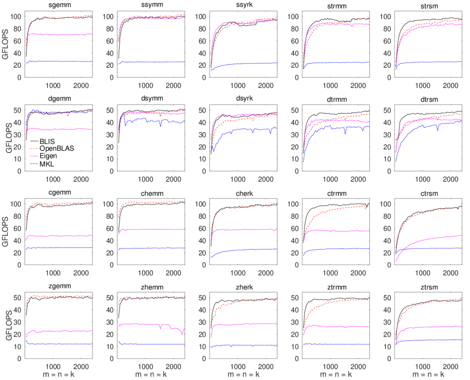
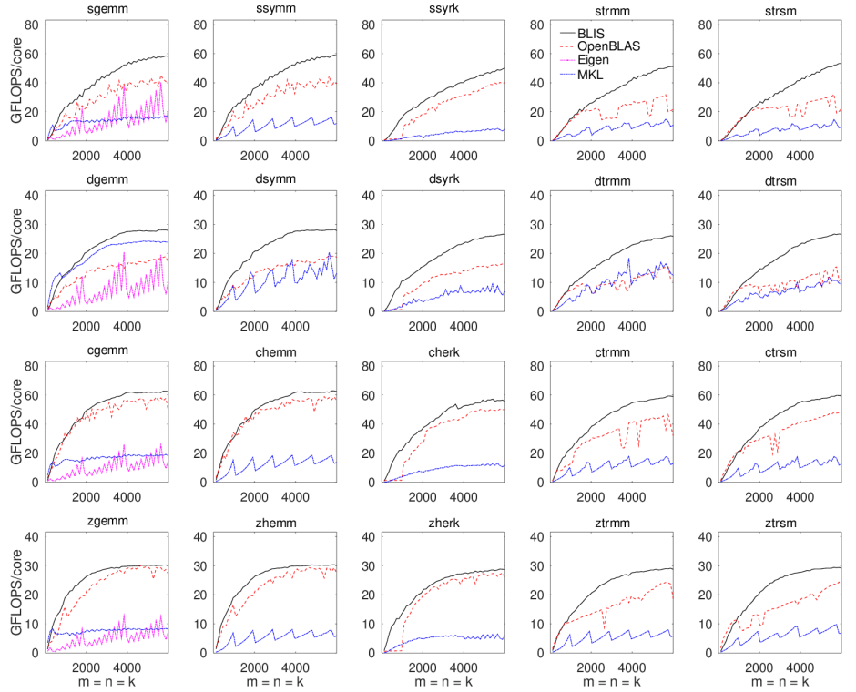
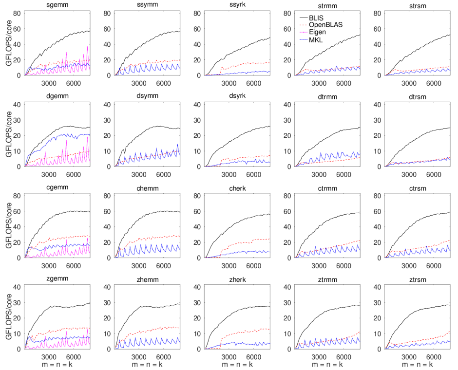
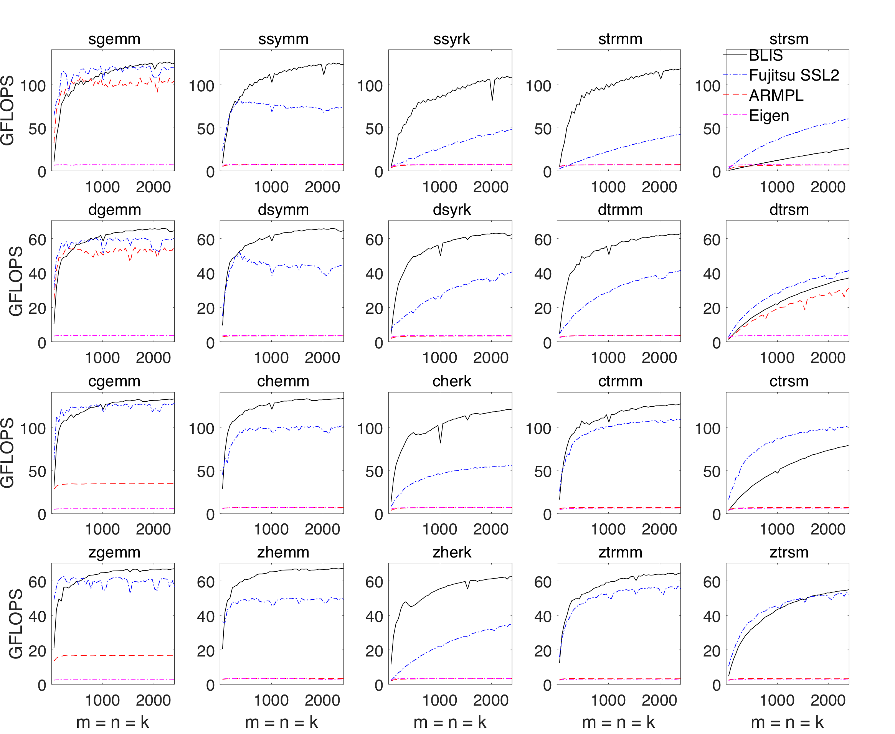
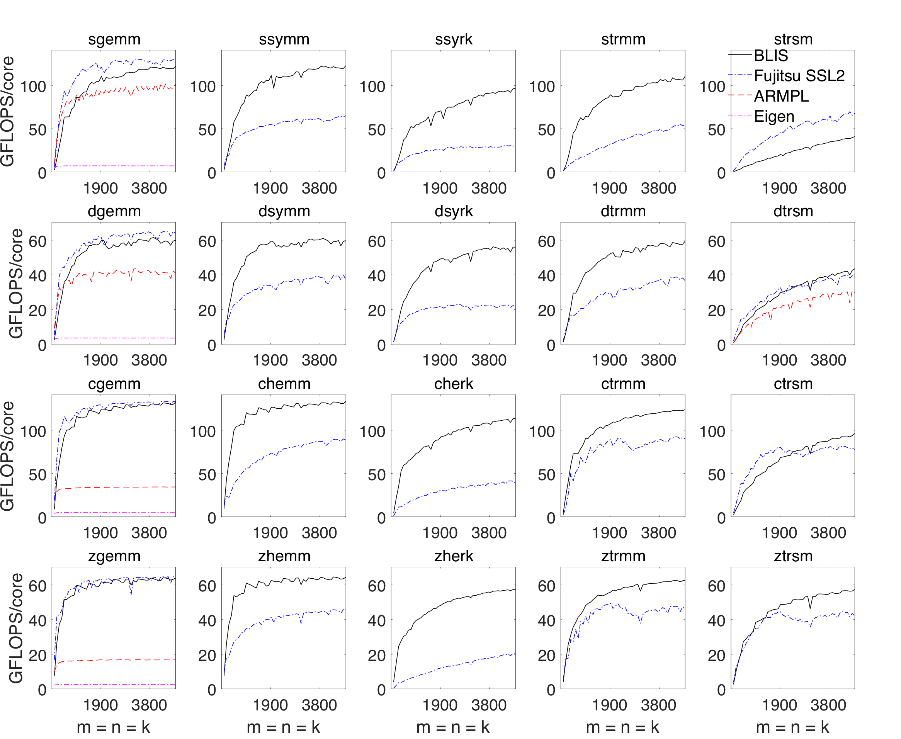
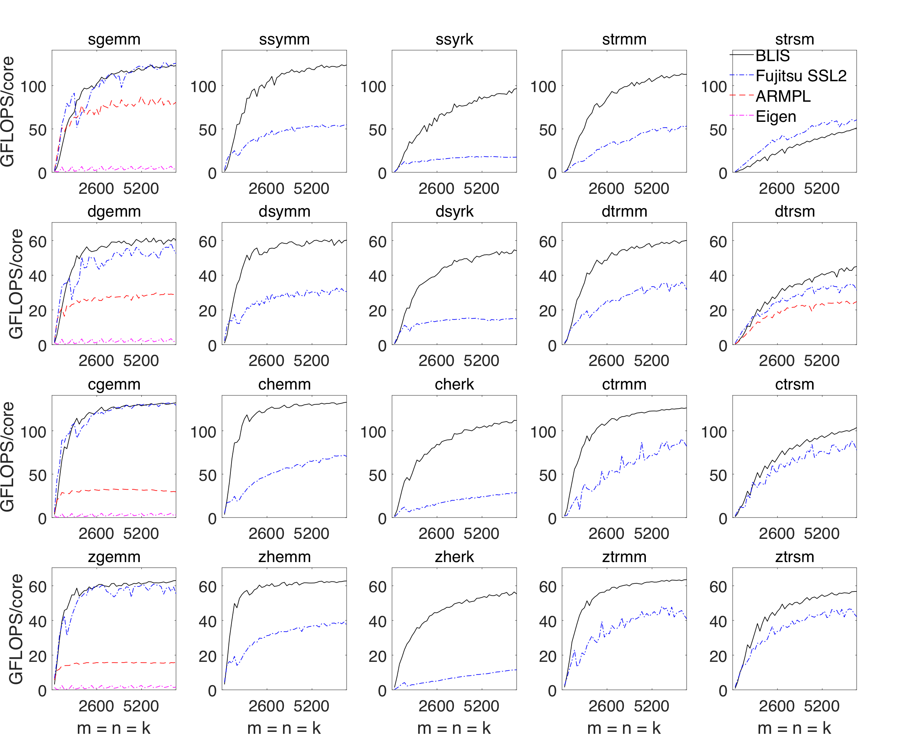

# Contents

* **[Contents](Performance.md#contents)**
* **[Introduction](Performance.md#introduction)**
* **[General information](Performance.md#general-information)**
* **[Interpretation](Performance.md#interpretation)**
* **[Reproduction](Performance.md#reproduction)**
* **[Level-3 performance](Performance.md#level-3-performance)**
  * **[ThunderX2](Performance.md#thunderx2)**
    * **[Experiment details](Performance.md#thunderx2-experiment-details)**
    * **[Results](Performance.md#thunderx2-results)**
  * **[SkylakeX](Performance.md#skylakex)**
    * **[Experiment details](Performance.md#skylakex-experiment-details)**
    * **[Results](Performance.md#skylakex-results)**
  * **[Haswell](Performance.md#haswell)**
    * **[Experiment details](Performance.md#haswell-experiment-details)**
    * **[Results](Performance.md#haswell-results)**
  * **[Zen](Performance.md#zen)**
    * **[Experiment details](Performance.md#zen-experiment-details)**
    * **[Results](Performance.md#zen-results)**
  * **[Zen2](Performance.md#zen2)**
    * **[Experiment details](Performance.md#zen2-experiment-details)**
    * **[Results](Performance.md#zen2-results)**
  * **[A64fx](Performance.md#a64fx)**
    * **[Experiment details](Performance.md#a64fx-experiment-details)**
    * **[Results](Performance.md#a64fx-results)**
  * **[Neoverse N1](Performance.md#neoverse-n1)**
    * **[Experiment details](Performance.md#neoverse-n1-experiment-details)**
    * **[Results](Performance.md#neoverse-n1-results)**
* **[Feedback](Performance.md#feedback)**

# Introduction

This document showcases performance results for a representative sample of
level-3 operations on large matrices with BLIS and BLAS for several hardware
architectures.

# General information

Generally speaking, for level-3 operations on large matrices, we publish three
"panels" for each type of hardware,
each of which reports one of: single-threaded performance, multithreaded
performance on a single socket, or multithreaded performance on two sockets.
Each panel will consist of a 4x5 grid of graphs, with each row representing
a different datatype (single real, double real, single complex, and double
complex) and each column representing a different operation (`gemm`,
`hemm`/`symm`, `herk`/`syrk`, `trmm`, and `trsm`).
Each of the 20 graphs within a panel will contain an x-axis that reports
problem size, with all matrix dimensions equal to the problem size (e.g.
_m_ = _n_ = _k_), resulting in square matrices.
The y-axis will report in units GFLOPS (billions of floating-point operations
per second) in the case of single-threaded performance, or GFLOPS/core in the
case of single- or dual-socket multithreaded performance, where GFLOPS/core
is simply the total GFLOPS observed divided by the number of threads utilized.
This normalization is done intentionally in order to facilitate a visual
assessment of the drop in efficiency of multithreaded performance relative
to their single-threaded baselines.

It's also worth pointing out that the top of each graph (e.g. the maximum
y-axis value depicted) _always_ corresponds to the theoretical peak performance
under the conditions associated with that graph.
Theoretical peak performance, in units of GFLOPS/core, is calculated as the
product of:
1. the maximum sustainable clock rate in GHz; and
2. the maximum number of floating-point operations (flops) that can be
executed per cycle (per core).

Note that the maximum sustainable clock rate may change depending on the
conditions.
For example, on some systems the maximum clock rate is higher when only one
core is active (e.g. single-threaded performance) versus when all cores are
active (e.g. multithreaded performance).
The maximum number of flops executable per cycle (per core) is generally
computed as the product of:
1. the maximum number of fused multiply-add (FMA) vector instructions that
can be issued per cycle (per core);
2. the maximum number of elements that can be stored within a single vector
register (for the datatype in question); and
3. 2.0, since an FMA instruction fuses two operations (a multiply and an add).

The problem size range, represented on the x-axis, is usually sampled with 50
equally-spaced problem size.
For example, for single-threaded execution, we might choose to execute with
problem sizes of 48 to 2400 in increments of 48, or 56 to 2800 in increments
of 56.
These values are almost never chosen for any particular (read: sneaky) reason;
rather, we start with a "good" maximum problem size, such as 2400 or 2800, and
then divide it by 50 to obtain the appropriate starting point and increment.

Finally, each point along each curve represents the best of three trials.

# Interpretation

In general, the the curves associated with higher-performing implementations
will appear higher in the graphs than lower-performing implementations.
Ideally, an implementation will climb in performance (as a function of problem
size) as quickly as possible and asymptotically approach some high fraction of
peak performance.

Occasionally, we may publish graphs with incomplete curves--for example,
only the first 25 data points in a typical 50-point series--usually because
the implementation being tested was slow enough that it was not practical to
allow it to finish.

Where along the x-axis you focus your attention will depend on the segment of
the problem size range that you care about most. Some people's applications
depend heavily on smaller problems, where "small" can mean anything from 10
to 1000 or even higher. Some people consider 1000 to be quite large, while
others insist that 5000 is merely "medium." What each of us considers to be
small, medium, or large (naturally) depends heavily on the kinds of dense
linear algebra problems we tend to encounter. No one is "right" or "wrong"
about their characterization of matrix smallness or bigness since each person's
relative frame of reference can vary greatly. That said, the
[Science of High-Performance Computing](http://shpc.ices.utexas.edu/) group at
[The University of Texas at Austin](https://www.utexas.edu/) tends to target
matrices that it classifies as "medium-to-large", and so most of the graphs
presented in this document will reflect that targeting in their x-axis range.

When corresponding with us, via email or when opening an
[issue](https://github.com/flame/blis/issues) on github, we kindly ask that
you specify as closely as possible (though a range is fine) your problem
size of interest so that we can better assist you.

# Reproduction

In general, we do not offer any step-by-step guide for how to reproduce the
performance graphs shown below.

That said, if you are keenly interested in running your own performance
benchmarks, either in an attempt to reproduce the results shown here or to
measure performance of different hardware, of different implementations (or
versions), and/or for different problem sizes, you should begin by studying
the source code, `Makefile`, and scripts in
the [test/3](https://github.com/flame/blis/tree/master/test/3) directory
of the BLIS source distribution. Then, you'll need to take time to build
and/or install some (or all) of the implementations shown (e.g.
[OpenBLAS](https://github.com/xianyi/OpenBLAS),
[MKL](https://software.intel.com/en-us/mkl/), and
[Eigen](http://eigen.tuxfamily.org), including BLIS. Be sure to consult
the detailed notes provided below; they should be *very* helpful in successfully
building the libraries. The `runme.sh` script in `test/3` will help you run
some (or all) of the test drivers produced by the `Makefile`, and the
Matlab/Octave function `plot_panel_4x5()` defined in the `matlab` directory
will help you turn the output of those test drivers into a PDF file of graphs.
The `runthese.m` file will contain example invocations of the function.

# Level-3 performance

## ThunderX2

### ThunderX2 experiment details

* Location: Unknown
* Processor model: Marvell ThunderX2 CN9975
* Core topology: two sockets, 28 cores per socket, 56 cores total
* SMT status: disabled at boot-time
* Max clock rate: 2.2GHz (single-core and multicore)
* Max vector register length: 128 bits (NEON)
* Max FMA vector IPC: 2
* Peak performance:
  * single-core: 17.6 GFLOPS (double-precision), 35.2 GFLOPS (single-precision)
  * multicore: 17.6 GFLOPS/core (double-precision), 35.2 GFLOPS/core (single-precision)
* Operating system: Ubuntu 16.04 (Linux kernel 4.15.0)
* Page size: unknown
* Compiler: gcc 7.3.0
* Results gathered: 14 February 2019
* Implementations tested:
  * BLIS 075143df (0.5.1-39)
    * configured with `./configure -t openmp thunderx2` (single- and multithreaded)
    * sub-configuration exercised: `thunderx2`
    * Single-threaded (1 core) execution requested via no change in environment variables
    * Multithreaded (28 core) execution requested via `export BLIS_JC_NT=4 BLIS_IC_NT=7`
    * Multithreaded (56 core) execution requested via `export BLIS_JC_NT=8 BLIS_IC_NT=7`
  * OpenBLAS 52d3f7a
    * configured `Makefile.rule` with `BINARY=64 NO_CBLAS=1 NO_LAPACK=1 NO_LAPACKE=1 USE_THREAD=0` (single-threaded)
    * configured `Makefile.rule` with `BINARY=64 NO_CBLAS=1 NO_LAPACK=1 NO_LAPACKE=1 USE_THREAD=1 NUM_THREADS=56` (multithreaded, 56 cores)
    * Single-threaded (1 core) execution requested via `export OPENBLAS_NUM_THREADS=1`
    * Multithreaded (28 core) execution requested via `export OPENBLAS_NUM_THREADS=28`
    * Multithreaded (56 core) execution requested via `export OPENBLAS_NUM_THREADS=56`
  * ARMPL 18.4
    * Single-threaded (1 core) execution requested via `export OMP_NUM_THREADS=1`
    * Multithreaded (28 core) execution requested via `export OMP_NUM_THREADS=28`
    * Multithreaded (56 core) execution requested via `export OMP_NUM_THREADS=56`
* Affinity:
  * Thread affinity for BLIS was specified manually via `GOMP_CPU_AFFINITY="0 1 2 3 ... 55"`. However, multithreaded OpenBLAS appears to revert to single-threaded execution if `GOMP_CPU_AFFINITY` is set. Therefore, when measuring OpenBLAS performance, the `GOMP_CPU_AFFINITY` environment variable was unset.
* Frequency throttling (via `cpupower`):
  * No changes made.
* Comments:
  * ARMPL performance is remarkably uneven across datatypes and operations, though it would appear their "base" consists of OpenBLAS, which they then optimize for select, targeted routines. Unfortunately, we were unable to test the absolute latest versions of OpenBLAS and ARMPL on this hardware before we lost access. We will rerun these experiments once we gain access to a similar system.

### ThunderX2 results

#### pdf

* [ThunderX2 single-threaded](graphs/large/l3_perf_tx2_nt1.pdf)
* [ThunderX2 multithreaded (28 cores)](graphs/large/l3_perf_tx2_jc4ic7_nt28.pdf)
* [ThunderX2 multithreaded (56 cores)](graphs/large/l3_perf_tx2_jc8ic7_nt56.pdf)

#### png (inline)

* **ThunderX2 single-threaded**

* **ThunderX2 multithreaded (28 cores)**

* **ThunderX2 multithreaded (56 cores)**


---

## SkylakeX

### SkylakeX experiment details

* Location: Oracle cloud
* Processor model: Intel Xeon Platinum 8167M (SkylakeX/AVX-512)
* Core topology: two sockets, 26 cores per socket, 52 cores total
* SMT status: enabled, but not utilized
* Max clock rate: 2.0GHz (single-core and multicore)
* Max vector register length: 512 bits (AVX-512)
* Max FMA vector IPC: 2
* Peak performance:
  * single-core: 64 GFLOPS (double-precision), 128 GFLOPS (single-precision)
  * multicore: 64 GFLOPS/core (double-precision), 128 GFLOPS/core (single-precision)
* Operating system: Ubuntu 18.04 (Linux kernel 4.15.0)
* Page size: 4096 bytes
* Compiler: gcc 7.3.0
* Results gathered: 6 March 2019, 27 March 2019
* Implementations tested:
  * BLIS 9f1dbe5 (0.5.1-54)
    * configured with `./configure -t openmp auto` (single- and multithreaded)
    * sub-configuration exercised: `skx`
    * Single-threaded (1 core) execution requested via no change in environment variables
    * Multithreaded (26 core) execution requested via `export BLIS_JC_NT=2 BLIS_IC_NT=13`
    * Multithreaded (52 core) execution requested via `export BLIS_JC_NT=4 BLIS_IC_NT=13`
  * OpenBLAS 0.3.5
    * configured `Makefile.rule` with `BINARY=64 NO_CBLAS=1 NO_LAPACK=1 NO_LAPACKE=1 USE_THREAD=0` (single-threaded)
    * configured `Makefile.rule` with `BINARY=64 NO_CBLAS=1 NO_LAPACK=1 NO_LAPACKE=1 USE_THREAD=1 NUM_THREADS=52` (multithreaded, 52 cores)
    * Single-threaded (1 core) execution requested via `export OPENBLAS_NUM_THREADS=1`
    * Multithreaded (26 core) execution requested via `export OPENBLAS_NUM_THREADS=26`
    * Multithreaded (52 core) execution requested via `export OPENBLAS_NUM_THREADS=52`
  * Eigen 3.3.90
    * Obtained via the [Eigen git mirror](https://github.com/eigenteam/eigen-git-mirror) (March 27, 2019)
    * Prior to compilation, modified top-level `CMakeLists.txt` to ensure that `-march=native` was added to `CXX_FLAGS` variable (h/t Sameer Agarwal):
         ```
         # These lines added after line 67.
         check_cxx_compiler_flag("-march=native" COMPILER_SUPPORTS_MARCH_NATIVE)
         if(COMPILER_SUPPORTS_MARCH_NATIVE)
           set(CMAKE_CXX_FLAGS "${CMAKE_CXX_FLAGS} -march=native")
         endif()
         ```
    * configured and built BLAS library via `mkdir build; cd build; cmake ..; make blas`
    * installed headers via `cmake . -DCMAKE_INSTALL_PREFIX=$HOME/flame/eigen; make install`
    * The `gemm` implementation was pulled in at compile-time via Eigen headers; other operations were linked to Eigen's BLAS library.
    * Single-threaded (1 core) execution requested via `export OMP_NUM_THREADS=1`
    * Multithreaded (26 core) execution requested via `export OMP_NUM_THREADS=26`
    * Multithreaded (52 core) execution requested via `export OMP_NUM_THREADS=52`
    * **NOTE**: This version of Eigen does not provide multithreaded implementations of `symm`/`hemm`, `syrk`/`herk`, `trmm`, or `trsm`, and therefore those curves are omitted from the multithreaded graphs.
  * MKL 2019 update 1
    * Single-threaded (1 core) execution requested via `export MKL_NUM_THREADS=1`
    * Multithreaded (26 core) execution requested via `export MKL_NUM_THREADS=26`
    * Multithreaded (52 core) execution requested via `export MKL_NUM_THREADS=52`
* Affinity:
  * Thread affinity for BLIS was specified manually via `GOMP_CPU_AFFINITY="0 1 2 3 ... 51"`. However, multithreaded OpenBLAS appears to revert to single-threaded execution if `GOMP_CPU_AFFINITY` is set. Therefore, when measuring OpenBLAS performance, the `GOMP_CPU_AFFINITY` environment variable was unset.
* Frequency throttling (via `cpupower`):
  * Driver: acpi-cpufreq
  * Governor: performance
  * Hardware limits: 1.0GHz - 2.0GHz
  * Adjusted minimum: 2.0GHz
* Comments:
  * MKL yields superb performance for most operations, though BLIS is not far behind except for `trsm`. (We understand the `trsm` underperformance and hope to address it in the future.) OpenBLAS lags far behind MKL and BLIS due to lack of full support for AVX-512, and possibly other reasons related to software architecture and register/cache blocksizes.

### SkylakeX results

#### pdf

* [SkylakeX single-threaded](graphs/large/l3_perf_skx_nt1.pdf)
* [SkylakeX multithreaded (26 cores)](graphs/large/l3_perf_skx_jc2ic13_nt26.pdf)
* [SkylakeX multithreaded (52 cores)](graphs/large/l3_perf_skx_jc4ic13_nt52.pdf)

#### png (inline)

* **SkylakeX single-threaded**

* **SkylakeX multithreaded (26 cores)**

* **SkylakeX multithreaded (52 cores)**


---

## Haswell

### Haswell experiment details

* Location: TACC (Lonestar5)
* Processor model: Intel Xeon E5-2690 v3 (Haswell)
* Core topology: two sockets, 12 cores per socket, 24 cores total
* SMT status: enabled, but not utilized
* Max clock rate: 3.5GHz (single-core), 3.1GHz (multicore)
* Max vector register length: 256 bits (AVX2)
* Max FMA vector IPC: 2
* Peak performance:
  * single-core: 56 GFLOPS (double-precision), 112 GFLOPS (single-precision)
  * multicore: 49.6 GFLOPS/core (double-precision), 99.2 GFLOPS/core (single-precision)
* Operating system: Cray Linux Environment 6 (Linux kernel 4.4.103)
* Page size: 4096 bytes
* Compiler: gcc 6.3.0
* Results gathered: 25-26 February 2019, 27 March 2019
* Implementations tested:
  * BLIS 075143df (0.5.1-39)
    * configured with `./configure -t openmp auto` (single- and multithreaded)
    * sub-configuration exercised: `haswell`
    * Single-threaded (1 core) execution requested via no change in environment variables
    * Multithreaded (12 core) execution requested via `export BLIS_JC_NT=2 BLIS_IC_NT=3 BLIS_JR_NT=2`
    * Multithreaded (24 core) execution requested via `export BLIS_JC_NT=4 BLIS_IC_NT=3 BLIS_JR_NT=2`
  * OpenBLAS 0.3.5
    * configured `Makefile.rule` with `BINARY=64 NO_CBLAS=1 NO_LAPACK=1 NO_LAPACKE=1 USE_THREAD=0` (single-threaded)
    * configured `Makefile.rule` with `BINARY=64 NO_CBLAS=1 NO_LAPACK=1 NO_LAPACKE=1 USE_THREAD=1 NUM_THREADS=24` (multithreaded, 24 cores)
    * Single-threaded (1 core) execution requested via `export OPENBLAS_NUM_THREADS=1`
    * Multithreaded (12 core) execution requested via `export OPENBLAS_NUM_THREADS=12`
    * Multithreaded (24 core) execution requested via `export OPENBLAS_NUM_THREADS=24`
  * Eigen 3.3.90
    * Obtained via the [Eigen git mirror](https://github.com/eigenteam/eigen-git-mirror) (March 27, 2019)
    * Prior to compilation, modified top-level `CMakeLists.txt` to ensure that `-march=native` was added to `CXX_FLAGS` variable (h/t Sameer Agarwal):
         ```
         # These lines added after line 67.
         check_cxx_compiler_flag("-march=native" COMPILER_SUPPORTS_MARCH_NATIVE)
         if(COMPILER_SUPPORTS_MARCH_NATIVE)
           set(CMAKE_CXX_FLAGS "${CMAKE_CXX_FLAGS} -march=native")
         endif()
         ```
    * configured and built BLAS library via `mkdir build; cd build; cmake ..; make blas`
    * installed headers via `cmake . -DCMAKE_INSTALL_PREFIX=$HOME/flame/eigen; make install`
    * The `gemm` implementation was pulled in at compile-time via Eigen headers; other operations were linked to Eigen's BLAS library.
    * Single-threaded (1 core) execution requested via `export OMP_NUM_THREADS=1`
    * Multithreaded (12 core) execution requested via `export OMP_NUM_THREADS=12`
    * Multithreaded (24 core) execution requested via `export OMP_NUM_THREADS=24`
    * **NOTE**: This version of Eigen does not provide multithreaded implementations of `symm`/`hemm`, `syrk`/`herk`, `trmm`, or `trsm`, and therefore those curves are omitted from the multithreaded graphs.
  * MKL 2018 update 2
    * Single-threaded (1 core) execution requested via `export MKL_NUM_THREADS=1`
    * Multithreaded (12 core) execution requested via `export MKL_NUM_THREADS=12`
    * Multithreaded (24 core) execution requested via `export MKL_NUM_THREADS=24`
* Affinity:
  * Thread affinity for BLIS was specified manually via `GOMP_CPU_AFFINITY="0 1 2 3 ... 23"`. However, multithreaded OpenBLAS appears to revert to single-threaded execution if `GOMP_CPU_AFFINITY` is set. Therefore, when measuring OpenBLAS performance, the `GOMP_CPU_AFFINITY` environment variable was unset.
* Frequency throttling (via `cpupower`):
  * No changes made.
* Comments:
  * We were pleasantly surprised by how competitive BLIS performs relative to MKL on this multicore Haswell system, which is a _very_ common microarchitecture, and _very_ similar to the more recent Broadwells, Skylakes (desktop), Kaby Lakes, and Coffee Lakes that succeeded it.

### Haswell results

#### pdf

* [Haswell single-threaded](graphs/large/l3_perf_has_nt1.pdf)
* [Haswell multithreaded (12 cores)](graphs/large/l3_perf_has_jc2ic3jr2_nt12.pdf)
* [Haswell multithreaded (24 cores)](graphs/large/l3_perf_has_jc4ic3jr2_nt24.pdf)

#### png (inline)

* **Haswell single-threaded**

* **Haswell multithreaded (12 cores)**

* **Haswell multithreaded (24 cores)**


---

## Zen

### Zen experiment details

* Location: Oracle cloud
* Processor model: AMD Epyc 7551 (Zen1 "Naples")
* Core topology: two sockets, 4 dies per socket, 2 core complexes (CCX) per die, 4 cores per CCX, 64 cores total
* SMT status: enabled, but not utilized
* Max clock rate: 3.0GHz (single-core), 2.55GHz (multicore)
* Max vector register length: 256 bits (AVX2)
* Max FMA vector IPC: 1
  * Alternatively, FMA vector IPC is 2 when vectors are limited to 128 bits each.
* Peak performance:
  * single-core: 24 GFLOPS (double-precision), 48 GFLOPS (single-precision)
  * multicore: 20.4 GFLOPS/core (double-precision), 40.8 GFLOPS/core (single-precision)
* Operating system: Ubuntu 18.04 (Linux kernel 4.15.0)
* Page size: 4096 bytes
* Compiler: gcc 7.3.0
* Results gathered: 6 March 2019, 19 March 2019, 27 March 2019
* Implementations tested:
  * BLIS 9f1dbe5 (0.5.1-54)
    * configured with `./configure -t openmp auto` (single- and multithreaded)
    * sub-configuration exercised: `zen`
    * Single-threaded (1 core) execution requested via no change in environment variables
    * Multithreaded (32 core) execution requested via `export BLIS_JC_NT=1 BLIS_IC_NT=8 BLIS_JR_NT=4`
    * Multithreaded (64 core) execution requested via `export BLIS_JC_NT=2 BLIS_IC_NT=8 BLIS_JR_NT=4`
  * OpenBLAS 0.3.5
    * configured `Makefile.rule` with `BINARY=64 NO_CBLAS=1 NO_LAPACK=1 NO_LAPACKE=1 USE_THREAD=0` (single-threaded)
    * configured `Makefile.rule` with `BINARY=64 NO_CBLAS=1 NO_LAPACK=1 NO_LAPACKE=1 USE_THREAD=1 NUM_THREADS=64` (multithreaded, 64 cores)
    * Single-threaded (1 core) execution requested via `export OPENBLAS_NUM_THREADS=1`
    * Multithreaded (32 core) execution requested via `export OPENBLAS_NUM_THREADS=32`
    * Multithreaded (64 core) execution requested via `export OPENBLAS_NUM_THREADS=64`
  * Eigen 3.3.90
    * Obtained via the [Eigen git mirror](https://github.com/eigenteam/eigen-git-mirror) (March 27, 2019)
    * Prior to compilation, modified top-level `CMakeLists.txt` to ensure that `-march=native` was added to `CXX_FLAGS` variable (h/t Sameer Agarwal):
         ```
         # These lines added after line 67.
         check_cxx_compiler_flag("-march=native" COMPILER_SUPPORTS_MARCH_NATIVE)
         if(COMPILER_SUPPORTS_MARCH_NATIVE)
           set(CMAKE_CXX_FLAGS "${CMAKE_CXX_FLAGS} -march=native")
         endif()
         ```
    * configured and built BLAS library via `mkdir build; cd build; cmake ..; make blas`
    * installed headers via `cmake . -DCMAKE_INSTALL_PREFIX=$HOME/flame/eigen; make install`
    * The `gemm` implementation was pulled in at compile-time via Eigen headers; other operations were linked to Eigen's BLAS library.
    * Single-threaded (1 core) execution requested via `export OMP_NUM_THREADS=1`
    * Multithreaded (32 core) execution requested via `export OMP_NUM_THREADS=32`
    * Multithreaded (64 core) execution requested via `export OMP_NUM_THREADS=64`
    * **NOTE**: This version of Eigen does not provide multithreaded implementations of `symm`/`hemm`, `syrk`/`herk`, `trmm`, or `trsm`, and therefore those curves are omitted from the multithreaded graphs.
  * MKL 2019 update 1
    * Single-threaded (1 core) execution requested via `export MKL_NUM_THREADS=1`
    * Multithreaded (32 core) execution requested via `export MKL_NUM_THREADS=32`
    * Multithreaded (64 core) execution requested via `export MKL_NUM_THREADS=64`
* Affinity:
  * Thread affinity for BLIS was specified manually via `GOMP_CPU_AFFINITY="0 1 2 3 ... 63"`. However, multithreaded OpenBLAS appears to revert to single-threaded execution if `GOMP_CPU_AFFINITY` is set. Therefore, when measuring OpenBLAS performance, the `GOMP_CPU_AFFINITY` environment variable was unset.
* Frequency throttling (via `cpupower`):
  * Driver: acpi-cpufreq
  * Governor: performance
  * Hardware limits: 1.2GHz - 2.0GHz
  * Adjusted minimum: 2.0GHz
* Comments:
  * MKL performance is dismal, despite being linked in the same manner as on the Xeon Platinum. It's not clear what is causing the slowdown. It could be that MKL's runtime kernel/blocksize selection logic is falling back to some older, more basic implementation because CPUID is not returning Intel as the hardware vendor. Alternatively, it's possible that MKL is trying to use kernels for the closest Intel architectures--say, Haswell/Broadwell--but its implementations use Haswell-specific optimizations that, due to microarchitectural differences, degrade performance on Zen.

### Zen results

#### pdf

* [Zen single-threaded](graphs/large/l3_perf_zen_nt1.pdf)
* [Zen multithreaded (32 cores)](graphs/large/l3_perf_zen_jc1ic8jr4_nt32.pdf)
* [Zen multithreaded (64 cores)](graphs/large/l3_perf_zen_jc2ic8jr4_nt64.pdf)

#### png (inline)

* **Zen single-threaded**

* **Zen multithreaded (32 cores)**

* **Zen multithreaded (64 cores)**


---

## Zen2

### Zen2 experiment details

* Location: Oracle cloud
* Processor model: AMD Epyc 7742 (Zen2 "Rome")
* Core topology: two sockets, 8 Core Complex Dies (CCDs) per socket, 2 Core Complexes (CCX) per CCD, 4 cores per CCX, 128 cores total
* SMT status: enabled, but not utilized
* Max clock rate: 2.25GHz (base, documented); 3.4GHz boost (single-core, documented); 2.6GHz boost (multicore, estimated)
* Max vector register length: 256 bits (AVX2)
* Max FMA vector IPC: 2
  * Alternatively, FMA vector IPC is 4 when vectors are limited to 128 bits each.
* Peak performance:
  * single-core: 54.4 GFLOPS (double-precision), 108.8 GFLOPS (single-precision)
  * multicore (estimated): 41.6 GFLOPS/core (double-precision), 83.2 GFLOPS/core (single-precision)
* Operating system: Ubuntu 18.04 (Linux kernel 4.15.0)
* Page size: 4096 bytes
* Compiler: gcc 9.3.0
* Results gathered: 24 September 2020, 29 September 2020
* Implementations tested:
  * BLIS 4fd8d9f (0.7.0-55)
    * configured with `./configure -t openmp auto` (single- and multithreaded)
    * sub-configuration exercised: `zen2`
    * Single-threaded (1 core) execution requested via no change in environment variables
    * Multithreaded (64 core) execution requested via `export BLIS_JC_NT=4 BLIS_IC_NT=4 BLIS_JR_NT=4`
    * Multithreaded (128 core) execution requested via `export BLIS_JC_NT=8 BLIS_IC_NT=4 BLIS_JR_NT=4`
  * OpenBLAS 0.3.10
    * configured `Makefile.rule` with `BINARY=64 NO_CBLAS=1 NO_LAPACK=1 NO_LAPACKE=1 USE_THREAD=0` (single-threaded)
    * configured `Makefile.rule` with `BINARY=64 NO_CBLAS=1 NO_LAPACK=1 NO_LAPACKE=1 USE_THREAD=1 NUM_THREADS=64` (multithreaded, 64 cores)
    * configured `Makefile.rule` with `BINARY=64 NO_CBLAS=1 NO_LAPACK=1 NO_LAPACKE=1 USE_THREAD=1 NUM_THREADS=128` (multithreaded, 128 cores)
    * Single-threaded (1 core) execution requested via `export OPENBLAS_NUM_THREADS=1`
    * Multithreaded (64 core) execution requested via `export OPENBLAS_NUM_THREADS=64`
    * Multithreaded (128 core) execution requested via `export OPENBLAS_NUM_THREADS=128`
  * Eigen 3.3.90
    * Obtained via the [Eigen GitLab homepage](https://gitlab.com/libeigen/eigen) (24 September 2020)
    * Prior to compilation, modified top-level `CMakeLists.txt` to ensure that `-march=native` was added to `CXX_FLAGS` variable (h/t Sameer Agarwal):
         ```
         # These lines added after line 60.
         check_cxx_compiler_flag("-march=native" COMPILER_SUPPORTS_MARCH_NATIVE)
         if(COMPILER_SUPPORTS_MARCH_NATIVE)
           set(CMAKE_CXX_FLAGS "${CMAKE_CXX_FLAGS} -march=native")
         endif()
         ```
    * configured and built BLAS library via `mkdir build; cd build; cmake ..; make blas`
    * installed headers via `cmake . -DCMAKE_INSTALL_PREFIX=$HOME/flame/eigen; make install`
    * The `gemm` implementation was pulled in at compile-time via Eigen headers; other operations were linked to Eigen's BLAS library.
    * Single-threaded (1 core) execution requested via `export OMP_NUM_THREADS=1`
    * Multithreaded (64 core) execution requested via `export OMP_NUM_THREADS=64`
    * Multithreaded (128 core) execution requested via `export OMP_NUM_THREADS=128`
    * **NOTE**: This version of Eigen does not provide multithreaded implementations of `symm`/`hemm`, `syrk`/`herk`, `trmm`, or `trsm`, and therefore those curves are omitted from the multithreaded graphs.
  * MKL 2020 update 3
    * Single-threaded (1 core) execution requested via `export MKL_NUM_THREADS=1`
    * Multithreaded (64 core) execution requested via `export MKL_NUM_THREADS=64`
    * Multithreaded (128 core) execution requested via `export MKL_NUM_THREADS=128`
* Affinity:
  * Thread affinity for BLIS was specified manually via `GOMP_CPU_AFFINITY="0-127"`. However, multithreaded OpenBLAS appears to revert to single-threaded execution if `GOMP_CPU_AFFINITY` is set. Therefore, when measuring OpenBLAS performance, the `GOMP_CPU_AFFINITY` environment variable was unset. 
  * All executables were run through `numactl --interleave=all`.
* Frequency throttling (via `cpupower`):
  * Driver: acpi-cpufreq
  * Governor: performance
  * Hardware limits (steps): 1.5GHz, 2.0GHz, 2.25GHz
  * Adjusted minimum: 2.25GHz
* Comments:
  * MKL performance is once again underwhelming. This is likely because Intel has decided that it does not want to give users of MKL a reason to purchase AMD hardware.

### Zen2 results

#### pdf

* [Zen2 single-threaded](graphs/large/l3_perf_zen2_nt1.pdf)
* [Zen2 multithreaded (64 cores)](graphs/large/l3_perf_zen2_jc4ic4jr4_nt64.pdf)
* [Zen2 multithreaded (128 cores)](graphs/large/l3_perf_zen2_jc8ic4jr4_nt128.pdf)

#### png (inline)

* **Zen2 single-threaded**

* **Zen2 multithreaded (64 cores)**

* **Zen2 multithreaded (128 cores)**


---

## A64fx

### A64fx experiment details

* Location: RIKEN Center of Computational Science in Kobe, Japan
  * These test results were gathered on the Fugaku supercomputer under project "量子物質の創発と機能のための基礎科学 ―「富岳」と最先端実験の密連携による革新的強相関電子科学" (hp200132) (Basic Science for Emergence and Functionality in Quantum Matter: Innovative Strongly-Correlated Electron Science by Integration of "Fugaku" and Frontier Experiments)
* Processor model: Fujitsu A64fx
* Core topology: one socket, 4 NUMA groups per socket, 13 cores per group (one reserved for the OS), 48 cores total
* SMT status: Unknown
* Max clock rate: 2.2GHz (single- and multicore, observed)
* Max vector register length: 512 bits (SVE)
* Max FMA vector IPC: 2
* Peak performance:
  * single-core: 70.4 GFLOPS (double-precision), 140.8 GFLOPS (single-precision)
  * multicore: 70.4 GFLOPS/core (double-precision), 140.8 GFLOPS/core (single-precision)
* Operating system: RHEL 8.3
* Page size: 256 bytes
* Compiler: gcc 10.1.0
* Results gathered: 2 April 2021; BLIS and SSL2 updated on 21 Sept 2021
* Implementations tested:
  * BLIS b05279d (post-0.8.1)
    * configured with:
      * `../configure -t none CFLAGS="-DCACHE_SECTOR_SIZE_READONLY" a64fx` (single-threaded)
      * `../configure -t openmp CFLAGS="-DCACHE_SECTOR_SIZE_READONLY" a64fx` (multithreaded)
    * sub-configuration exercised: `a64fx`
    * Single-threaded (1 core) execution requested via no change in environment variables
    * Multithreaded (12 core) execution requested via `export BLIS_JC_NT=1 BLIS_IC_NT=1 BLIS_JR_NT=12`
    * Multithreaded (48 core) execution requested via `export BLIS_JC_NT=1 BLIS_IC_NT=4 BLIS_JR_NT=12`
  * Eigen 3.3.9
    * Obtained via the [Eigen GitLab homepage](https://gitlab.com/libeigen/eigen)
    * configured and built BLAS library via `mkdir build; cd build; cmake ..; make blas`
    * installed headers via `cmake . -DCMAKE_INSTALL_PREFIX=$HOME/flame/eigen; make install`
    * The `gemm` implementation was pulled in at compile-time via Eigen headers; other operations were linked to Eigen's BLAS library.
    * Single-threaded (1 core) execution requested via `export OMP_NUM_THREADS=1`
    * Multithreaded (12 core) execution requested via `export OMP_NUM_THREADS=12`
    * Multithreaded (48 core) execution requested via `export OMP_NUM_THREADS=48`
    * **NOTE**: This version of Eigen does not provide multithreaded implementations of `symm`/`hemm`, `syrk`/`herk`, `trmm`, or `trsm`, and therefore those curves are omitted from the multithreaded graphs.
  * ARMPL (20.1.0 for A64fx)
    * Single-threaded (1 core) execution requested via `export OMP_NUM_THREADS=1`
    * Multithreaded (12 core) execution requested via `export OMP_NUM_THREADS=12`
    * Multithreaded (48 core) execution requested via `export OMP_NUM_THREADS=48`
    * **NOTE**: While this version of ARMPL does provide multithreaded implementations of `symm`/`hemm`, `syrk`/`herk`, `trmm`, or `trsm` (with the exception `dtrsm`), but these implementations yield very low performance, and their long run times led us to skip collecting these data altogether.
  * Fujitsu SSL2 (Fujitsu toolchain 1.2.33)
    * Single-threaded (1 core) execution requested via `export OMP_NUM_THREADS=1 NPARALLEL=1`
    * Multithreaded (12 core) execution requested via `export OMP_NUM_THREADS=12 NPARALLEL=12`
    * Multithreaded (48 core) execution requested via `export OMP_NUM_THREADS=48 NPARALLEL=48`
* Affinity:
  * Thread affinity for BLIS was specified manually via `GOMP_CPU_AFFINITY="12-23 24-35 36-47 48-59"`.
  * All executables were run through `numactl --interleave=all` (multithreaded only).
* Frequency throttling: No change made. No frequency lowering observed.
* Comments:
  * Special thanks to Stepan Nassyr and RuQing G. Xu for their work in developing and optimizing A64fx support. Also, thanks to RuQing G. Xu for collecting the data that appear in these graphs.

### A64fx results

#### pdf

* [A64fx single-threaded](graphs/large/l3_perf_a64fx_nt1.pdf)
* [A64fx multithreaded (12 cores)](graphs/large/l3_perf_a64fx_jc1ic1jr12_nt12.pdf)
* [A64fx multithreaded (48 cores)](graphs/large/l3_perf_a64fx_jc1ic4jr12_nt48.pdf)

#### png (inline)

* **A64fx single-threaded**

* **A64fx multithreaded (12 cores)**

* **A64fx multithreaded (48 cores)**


---

## Neoverse N1

### Neoverse N1 experiment details

* Location: AWS cloud
* Processor model: Graviton2 Neoverse N1
* Core topology: one socket, 64 cores per socket, 64 cores total
* SMT status: none
* Max clock rate: 2.5GHz (single-core and multicore)
* Max vector register length: 128 bits (NEON)
* Max FMA vector IPC: 2
* Peak performance:
  * single-core: 20.0 GFLOPS (double-precision), 40.0 GFLOPS (single-precision)
  * multicore: 20.0 GFLOPS/core (double-precision), 40.0 GFLOPS/core (single-precision)
* Operating system: unknown
* Page size: unknown
* Compiler: gcc 10.3.0
* Results gathered: 15 July 2021
* Implementations tested:
  * BLIS fab5c86d (0.8.1-67)
    * configured with `./configure -t openmp thunderx2` (single- and multithreaded)
    * sub-configuration exercised: `thunderx2`
    * Single-threaded (1 core) execution requested via no change in environment variables
    * Multithreaded (64 core) execution requested via `export BLIS_NUM_THREADS=64`
  * OpenBLAS 0.3.17
    * configured `Makefile.rule` with `BINARY=64 NO_CBLAS=1 NO_LAPACK=1 NO_LAPACKE=1 USE_THREAD=0` (single-threaded)
    * configured `Makefile.rule` with `BINARY=64 NO_CBLAS=1 NO_LAPACK=1 NO_LAPACKE=1 USE_THREAD=1 NUM_THREADS=64` (multithreaded, 64 cores)
    * Single-threaded (1 core) execution requested via `export OPENBLAS_NUM_THREADS=1`
    * Multithreaded (64 core) execution requested via `export OPENBLAS_NUM_THREADS=64`
* Affinity:
  * Thread affinity for BLIS was specified manually via `GOMP_CPU_AFFINITY="0-63"`. However, multithreaded OpenBLAS appears to revert to single-threaded execution if `GOMP_CPU_AFFINITY` is set. Therefore, when measuring OpenBLAS performance, the `GOMP_CPU_AFFINITY` environment variable was unset.
* Frequency throttling (via `cpupower`):
  * No changes made.
* Comments:
  * N/A

### Neoverse N1 results

#### pdf

* [Neoverse N1 single-threaded](graphs/large/l3_perf_nn1_nt1.pdf)
* [Neoverse N1 multithreaded (64 cores)](graphs/large/l3_perf_nn1_jc2ic8jr4_nt64.pdf)

#### png (inline)

* **Neoverse N1 single-threaded**

* **Neoverse N1 multithreaded (64 cores)**


---

# Feedback

Please let us know what you think of these performance results! Similarly, if you have any questions or concerns, or are interested in reproducing these performance experiments on your own hardware, we invite you to [open an issue](https://github.com/flame/blis/issues) and start a conversation with BLIS developers.

Thanks for your interest in BLIS!

