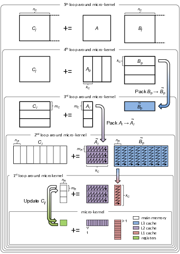

# Contents

* **[Introduction](PluginHowTo.md#introduction)**
  * **[Example Plugin](PluginHowTo.md#example-plugin)**
  * **[Creating a New Plugin](PluginHowTo.md#creating-a-new-plugin)**
  * **[Building a Plugin](PluginHowTo.md#building-a-plugin)**
* **[Kernels](PluginHowTo.md#kernels)**
  * **[Accessing Kernels](PluginHowTo.md#accessing-kernels)**
  * **[Reference Kernels](PluginHowTo.md#reference-kernels)**
  * **[Optimized Kernels](PluginHowTo.md#optimized-kernels)**
  * **[Mappign Kernels to Subconfigurations](PluginHowTo.md#mapping-kernels-to-subconfigurations)**
* **[Custom Operations](PluginHowTo.md#custom-operations)**
  * **[Example: `bli_gemmt_ex`](PluginHowTo.md#example-bli_gemmt_ex)**
  * **[The Control Tree](PluginHowTo.md#the-control-tree)**
  * **[Modifying the Control Tree](PluginHowTo.md#modifying-the-control-tree)**
  * **[Modifications to Blocking](PluginHowTo.md#modifications-to-blocking)**
  * **[Modifications to Packing](PluginHowTo.md#modifications-to-packing)**
  * **[Modifications to Computation](PluginHowTo.md#modifications-to-computation)**
  * **[SYRKD](PluginHowTo.md#syrkd)**
<!--
* **[API Reference](PluginHowTo.md#api-reference)**
  * **[Registration](PluginHowTo.md#registration)**
  * **[Helper Functions](PluginHowTo.md#helper-functions)**
  * **[Context Initialization](PluginHowTo.md#context-initialization)**
  * **[Context Query](PluginHowTo.md#context-query)**
  * **[Control tree modification](PluginHowTo.md#control-tree-modification)**
-->

# Introduction

A BLIS plugin is a piece of user-defined code that provides additional linear algebra functionality, but leverages BLIS's internal framework for high performance. Through a plugin, users can:

* Provide customized or optimized [kernels](PluginHowTo.md#kernels), and access internal BLIS kernels.
* Define new, custom linear algebra [operations](PluginHowTo.md#custom-operations) which extend the level-3 BLAS (for example, `GEMM`).

Plugins are defined completely externally to BLIS (that is, the BLIS source code is not required). However, an installed copy of BLIS 2.0 or later is required (assumed installed to `$PREFIX`) in order to configure or build a plugin. Building a plugin then results in a shared and/or static library which can be distributed or linked into your code. The template and example files generated by BLIS are all in C99, but C++ is also supported.

## Example Plugin

A new plugin is created by running `$PREFIX/share/blis/configure-plugin <name>`, where `<name>` is the name you wish to give to the plugin which must be a valid C99 identifier. By default, this generates a fully-functioning example plugin containing the following files:

<normal><pre><code>├─ [Makefile](PluginHowTo.md#makefile) **
├─ [config.mk](PluginHowTo.md#configmk) **
├─ [config_registry](PluginHowTo.md#config_registry) **
├─ [bli_plugin_\<name\>.h](PluginHowTo.md#bli_plugin_nameh)
├─ [bli_plugin_register.c](PluginHowTo.md#bli_plugin_registerc)
├─ config
│  ├─ \<config_1\>
│  ├─ ...
│  └─ \<config_n\>
│     ├─ [bli_kernel_defs_\<config\>.h](PluginHowTo.md#configconfigbli_kernel_defs_configh)
│     ├─ [bli_plugin_init_\<config\>.c](PluginHowTo.md#configconfigbli_plugin_init_configc)
│     └─ [make_defs.mk](PluginHowTo.md#configarchmake_defsmk)
├─ ref_kernels
│  ├─ [bli_plugin_init_ref.c](PluginHowTo.md#ref_kernelsbli_plugin_init_refc)
│  ├─ [my_kernel_1_ref.c](PluginHowTo.md#ref_kernelsmy_kernel_1_refc-and-my_kernel_2_refc) *
│  └─ [my_kernel_2_ref.c](PluginHowTo.md#ref_kernelsmy_kernel_1_refc-and-my_kernel_2_refc) *
├─ kernels
│  ├─ \<arch_1\>
│  ├─ ...
│  └─ zen3
│     └─ [my_kernel_1_zen3.c](PluginHowTo.md#kernelszen3my_kernel_1_zen3c) *
└─ obj **
&nbsp;  └─ [\<config\>](PluginHowTo.md#objconfig) **
</code></pre></normal>

Files marked with `*` (and some portions of other files) are for example only and can be omitted by passing the `--disable-examples` flag to `configure-plugin`. Files and directories marked with `**` are only required when you are ready to build the plugin and can be disabled with `--disable-build`. The remaining files and directories constitute the plugin "template". If you want to later generate only build files then these files (which presumably already exist) can be skipped with `--disable-templates`.

#### `Makefile`

The Makefile for your plugin is automatically generated by `configure-plugin` and should not be modified. Targets `make` and `make clean` are supported and will build your plugin based on the flags given during configuration.

#### `config.mk`

This file is also generated by `configure-plugin` and should not need to be modified.

#### `config_registry`

This file is provides the mapping from kernel sets to subconfigurations and configuration families. See [Mapping Kernels to Subconfigurations](PluginHowTo.md#mapping-ernels-to-subconfigurations) for more details.

#### `bli_plugin_<name>.h`

This file is the main header for the plugin. It should be `#include`d in order to use the functionality provided by the plugin. ***Note:*** the name and contents of this header are a suggestion---feel free to structure your plugin however you like!

The example file contains several sections:

* Macros defining arguments to be passed to the registration functions. The example given uses externally-provided arrays to store the generated kernel, blocksize, and preference IDs. Many alternative strategies are possible, e.g. passing a struct, passing individual pointers/references to IDs, or using global variables and passing no arguments (defining these macros to be empty). You can also pass in any other arguments you might need during registration. Macros are preferred to define the parameters since the parameter list is used in several different files and in generated code.

* Enumerations providing convenient names by which kernel/blocksize/preference IDs can be obtained. In the example, these are offsets into the arrays passed into the `bli_plugin_register_<name>`. So, calling code could look up the kernel ID for kernel #2 as `kerids[MY_KERNEL_2]`. This section is entirely optional if you prefer a different way of accessing kernel IDs.

* Prototypes for kernels. A prototype (and preferably a typedef) is recommended for each kernel you write so that you can provide type safety when calling kernels. Note that both kernels are assumed to have reference implementations (one for each enabled subconfiguration, expanded using the `INSERT_GENTCONF` macro to generate prototypes automatically), while a special "optimized" kernel #2 is available for double-precision operations on Zen 3 hardware. The latter prototype is given only for example---your plugin code would not need to know whether or not an optimized kernel is available and would only need to look up kernels by ID. The file `config/zen3/bli_plugin_init_zen3.c` handles registering this optimized kernel so that it can be automatically selected when running on Zen 3.

* Prototypes for the plugin registration function (`bli_plugin_register_<name>`) and configuration-specific initialization functions. The former function can be named and structured however you like, but we recommend keeping the latter (configuration-specific) functions as-is.

#### `bli_plugin_register.c`

This file implements the function `bli_plugin_register_<name>` and illustrates how to register new kernels, along with associated blocksizes and kernel preferences. Each registration function generates a new, unique ID which must be saved and communicated to the rest of the plugin (for example, via global variables or arguments passed in to the function `bli_plugin_register_<name>`) so that they can be used later. This function also calls `bli_plugin_register_<name>_<config>` for each architecture which was enabled at configure time (see [`bli_plugin_init_<config>.c`](PluginHowTo.md#configconfigbli_plugin_init_configc)).

Any code using the plugin should call this function (which you can rename if you like) before making use of any plugin functionality.

#### `config/<config>/bli_kernel_defs_<config>.h`

This file provides macros specific to one subconfiguration, such as the register blocksizes for the BLIS `GEMM` microkernel. You can add any macros or other definitions here that you want to be avialable to any code being compiled for the corresponding subcofiguration. Note that configuration families (e.g. `x86_64`) supersede individual subconfigurations.

#### `config/<config>/bli_plugin_init_<config>.c`

This file initializes the "context" with any kernels, blocksizes, or kernel preference which are optimized for the corresponding subconfiguration. It also call the reference initialization function in [`ref_kernels/bli_plugin_init_ref.c`](PluginHowTo.md#ref_kernelsbli_plugin_init_refc) for the matching configuration. A full example is given for the `zen3` subconfiguration. If no optimized kernels have been written for a particular subconfiguration, then no modifications are necessary. See [Mapping Kernels to Subconfigurations](PluginHowTo.md#mapping-ernels-to-subconfigurations) for more information about how optimized kernels and subconfigurations are related.

#### `config/<config>/make_defs.mk`

This file contains additional build variables or compiler-/architecture-specific flags for each subconfiguration. Typically these files should not be modified in order to achieve the best performance and maintain compatibility with BLIS.

#### `ref_kernels/bli_plugin_init_ref.c`

This file handles initialization of the context with [reference](PluginHowTo.md#reference-kernels) kernels. This file is compiled once for each enabled subconfiguration, resulting in functions `bli_plugin_init_<name>_<config>_ref`. Whenever you add a new reference kernel, blocksize, or kernel preference, you must also add code to initialize it here.

#### `ref_kernels/my_kernel_1_ref.c` and `my_kernel_2_ref.c`

These are example reference kernels. Note that the kernels are instantiated for the four standard datatypes (single and double precision, for both real and complex domains), indicated by the letters `sdcz`. Your kernels can use the same macros to help with instantiation of different types (or combinations of types), or you can use a different mechanism such as C++ templates.

#### `kernels/zen3/my_kernel_1_zen3.c`

This is an example optimized kernel. Typically optimized kernels are written with a specific data type or combination of data types in mind. In this example, only a double-precision real version is implemented, specifically for the Zen 3 architecture.

#### `obj/<config>`

This folder will contain the built object files and static and/or shared library for the plugin. Only one sub-folder is created corresponding to the configuration for which BLIS was built.

## Creating a New Plugin

To create a "blank" plugin without any build files or example code, execute `$PREFIX/share/blis/configure-plugin --init <name>` in the directory where you want the plugin to exist. At this point, you can start adding your own:

* Kernels, [see below](PluginHowTo.md#kernels) for more details
  1. Create a reference kernel. The file must be in the `ref_kernels` directory in order to be compiled correctly. Your kernel can any name and interface, but should ideally be implemented for all supported data types and should be architecture-agnostic.
  2. Register your kernel in the `bli_plugin_register.c` file.
  3. Initialize the context with pointer(s) to your reference kernel in the `ref_kernels/bli_plugin_init_ref.c` file.
  4. [Optionally] implemented optimized versions in the appropriate `kernels/<arch>` directories, and initialize them in `config/<config>/bli_plugin_init_<config>.c`
* Blocksizes
  1. Register the blocksizes in `bli_plugin_register.c`.
  2. Provide default values in `ref_kernels/bli_plugin_init_ref.c`. All data types should be given a default value.
  3. [Optional] provide values for configuration-specific optimized implementations in `config/<config>/bli_plugin_init_<config>.c`.
* Kernel preferences
  1. Register the kernel preferences in `bli_plugin_register.c`.
  2. Provide default values in `ref_kernels/bli_plugin_init_ref.c`. All data types should be given a default value.
  3. [Optional] provide values for configuration-specific optimized implementations in `config/<config>/bli_plugin_init_<config>.c`.

You will also need to provide a way to get registered kernel/blocksize/preference IDs back to your code by filling in the `plugin_<name>_params` and `plugin_<name>_params_only` macros in `bli_plugin_<name>.h`, saving to global variables, etc.

## Building a Plugin

Before building your kernel on a particular system, you must reconfigure to build using `$PREFIX/share/blis/configure-plugin --build [<name>]` in the plugin directory. Note that you do not need to provide the plugin name if it can be guessed from the name of `bli_plugin_<name>.h`. There are several flags which can be used to control how your plugin will be built:

| Flag                  | Explanation |
|-----------------------|-------------|
| -p PATH,<br>--path=PATH  | Look for the plugin source in PATH instead of the current directory. This option is used to build the plugin out-of-tree. |
| -e SYMBOLS,<br>--export-shared[=SYMBOLS] | Specify the subset of library symbols that are exported within a shared library. Valid values for SYMBOLS are: 'public' (the default) and 'all'. By default, only functions and variables that belong to public APIs are exported in shared libraries. However, the user may instead export all symbols in BLIS, even those that were intended for internal use only. Note that the public APIs encompass all functions that almost any user would ever want to call, including the BLAS/CBLAS compatibility APIs as well as the basic and expert interfaces to the typed and object APIs that are unique to BLIS. Also note that changing this option to 'all' will have no effect in some environments, such as when compiling with clang on Windows. |
| --enable-rpath,<br>--disable-rpath | Enable (disabled by default) setting an install_name for dynamic libraries on macOS which starts with @rpath rather than the absolute install path. |
| --disable-shared,<br>--enable-shared | Disable (enabled by default) building BLIS as a shared library. If the shared library build is disabled, the static library build must remain enabled. |
| --disable-static,<br>--enable-static | Disable (enabled by default) building BLIS as a static library. If the static library build is disabled, the shared library build must remain enabled. |
| -d DEBUG, --enable-debug[=DEBUG] | Enable debugging symbols in the library. If argument DEBUG is given as 'opt', then optimization flags are kept in the framework, otherwise optimization is turned off. |
| --enable-verbose-make,<br>--disable-verbose-make | Enable (disabled by default) verbose compilation output during make. |
| -f, --force | Overwrite any files in the current directory which are normally copied by configure-plugin, for example 'Makefile' and 'config_registry'. |
| --enable-asan,<br>--disable-asan | Enable (disabled by default) compiling and linking BLIS framework code with the AddressSanitizer (ASan) library. Optimized kernels are NOT compiled with ASan support due to limitations of register assignment in inline assembly. WARNING: ENABLING THIS OPTION WILL NEGATIVELY IMPACT PERFORMANCE. Please use only for informational/debugging purposes. |
| --enable-arg-max-hack<br>--disable-arg-max-hack | Enable (disabled by default) build system logic that will allow archiving/linking the static/shared library even if the command plus command line arguments exceeds the operating system limit (ARG_MAX). |

After configuring, you can now build using `make`. **Your plugin is always built for the same subconfiguration or configuration family that BLIS was.** This means that build configuration should ideally be done on the target system, unless you are using an installation of BLIS which is configured for a "fat build" for a full configuration familty, such as `x86_64`. The final shared and/or static library is available in the `obj/<config>` directory, where `<config>` is the configuration that BLIS and your plugin are built for.

# Kernels

Kernels are the high-performance pieces of code at the heart of BLIS. A kernel usually does one simple computational operation on one or more input matrices, vectors, or scalars. For example, one of the workhorse kernels in BLIS is the `GEMM` microkernel, which computes a small matrix multiplication of `MR*k` and `k*NR` matrices, where `MR` and `NR` are constants depending on the architecture. You can write kernels which are intended to replace or extend existing BLIS kernels, or for any other operation which you might encounter in your code which needs a high-performance, architecture-specific solution.

The BLIS plugin architecture supports two types of user-supplied kernels: reference kernels and optimized kernels. The former type of kernel is coded once (typically in standard C or C++), and compiled separately for any architecture which might be encountered. Then, at runtime BLIS will select the appropriate version of the kernel for the current hardware. Reference kernels typically do not achieve the highest performance, but are useful for less performance-sensitive operations such as data movement (which is bandwidth limited and not FLOP limited). For performance-critical kernels, you can additionally provide optimized kernels. These kernels are specific to one hardware architecture or family of related architectures, and are also often datatype-specific. These kernels also often employ compiler intrinsics or inline assembly which is not portable. If you provide an optimized kernel for a hardware architecture which is detected at runtime, BLIS will automatically select this kernel in preference to the reference kernel.

In addition to kernels, BLIS plugins support providing blocksizes (for example, the `MR` and `NR` parameters above) as well as kernel preferences (essentially, the logical true/false equivalent of blocksizes) which control or define the behavior of kernels. These too are looked-up based on the actual hardware encountered at runtime, and come in reference (essentially, default) and optimized flavors. While internal BLIS kernels endeavor to operate correctly for any kind of input (although they work most efficiently for inputs which conform to the corresponding block sizes and preferences), your kernels are not required to support arbitrary inputs or parameters. You only have to provide the functionality that you know you will need!

## Accessing Kernels

Kernels, blocksizes, and kernel preferences are accessed through the "context", which reflects the kernel set available for the hardware on which BLIS is running. Initially, kernels and their parameters must be registered. This creates a slot in the context to hold pointers, blocksizes, or other data, and then returns a unique ID. Next, this slot must be filled with user-supplied data (pointers to reference kernels, default blocksizes, etc.), using the supplied IDs. If optimized kernels or parameters are avialable these are then written over the reference data. All of these steps happen during plugin registration which must happen before any computations are performed with the plugin (although BLIS itself can be used). Finally, at any point after plugin registratation, the current context can be obtained and then queried using the unique IDs:

```C++
const cntx_t* cntx = bli_gks_query_cntx();

my_fun_ptr kernel = ( my_fun_ptr )bli_cntx_get_ukr_dt( BLIS_DOUBLE, MY_KERNEL_ID, cntx );

kernel(...);
```

The process for registering and intializing kernels is detailed below.

## Reference Kernels

A reference kernel must first be registered. This should happen in `bli_plugin_register_<name>` defined in `bli_plugin_register.c` (although you can change the function and file names):

```C++
err_t errval;
kerid_t id;

err = bli_gks_register_ukr( &id );
if ( err != BLIS_SUCCESS )
    //handle error
```

Note that for registration we don't need to know anything about the actual kernel yet. Next, the pointers to the reference kernels must be supplied in the file `ref_kernels/bli_plugin_init_ref.c` (again, you can change the filename, but it must reside in `ref_kernels`, and it is not recommended to change the function name or signature since this must match `bli_plugin_register.c` and is generated automatically for each subconfiguration):

```C++
func_t ptrs;
gen_func_init( &ptrs, PASTECH(my_kernel,BLIS_CNAME_INFIX,BLIS_REF_SUFFIX) );
bli_cntx_set_ukr( MY_KERNEL_ID, &ptrs, cntx );
```

The `func_t` struc contains a function pointer for each data type. In this example the helper macro `gen_func_init` is used to automatically generate the correct symbol name for each type and for the current subconfiguration (since this file is compiled once for each enabled subconfiguration). It is strongly recommended to use the provided macros and naming convention for reference kernels. However, you are free to use any method you like to fill the entries of the `func_t` struct, *with pointers to the reference function of the correct type and for the correct subfiguration*. The kernel is now fully initialized and can be used safely on any hardware which BLIS was configured for.

## Optimized Kernels

If an optimized kernel implementation is available (as a function in a file in some  `kernels/<arch>` folder), it should be initialized in the appropriate file `config/<config>/bli_plugin_init_<config>.c`. For example:

```C++
bli_cntx_set_ukrs
(
  cntx,

  MY_KERNEL_ID, BLIS_DOUBLE, bli_dmy_kernel_zen3,

  BLIS_VA_END
);
```

Here, it is not necessary to provide an optimized implementation for all datatypes. The automatically-generated template code and build system will handle building the correct files and calling the initialization functions for subconfigurations which are enabled in the BLIS installation you are using. So, you can simply provide optimized implementations for any hardware which is important to you and it will be picked up and used if possible.

## Mapping Kernels to Subconfigurations

It may seem strange that optimized kernel implementations are written in the `kernels` folder, but are initialized in the `config` folder. In fact, the sub-folders of these two directories are not even the same! This is because in BLIS, multiple *subconfigurations* (roughly mapping to specific hardware architectures), as well as *configuration families* (for example, all `x86_64` architectures), can use kernels from one (or more) of the folders in `kernels`, called *kernel sets*. The mapping from kernel sets to configurations is defined by the `config_registry` file. Essentially, this means that when adding an optimized kernel, you should initialize the kernel in each configuration which maps the kernel set where you defined the kernel. Conversely, this also means that if you define the kernel in a kernel set which is not mapped by any enabled configuration, then the kernel will not exist and linking will fail.

By default, this file contains the mapping known by BLIS at the time of plugin creation. Thus, it might be a good idea to periodically reconfigure your plugin in order to pick up new `config` or `kernels` sub-folders and entries in `config_registry`. Instead, or in addition, you can define your own mappings in `config_registry` to reflect how your particular kernels should be used. *Note that this mapping only affects kernels in your plugin, and does not affect reference kernels.* See [here](ConfigurationHowTo.md) for more information on subconfigurations, configuration families, and mapping of kernel sets.

# Custom Operations

BLIS is written as a framework, meaning that user-written code can be inserted in order to achieve new functionality. For example, consider the mathematical operation $\mathop{\text{tri}}(C) := \mathop{\text{tri}}(\alpha A D A^T + \beta C)$ where $D$ is a diagonal matrix and the function `tri` operates only on the upper or lower part of a matrix. If $D$ were the identity matrix, then this would be a standard level-3 BLAS operation, `SYRK`, so we call this BLAS-like operation `SYRKD`. While it is technically not necessary to use the plugin infrastructure to implement `SYRKD` using BLIS, extending BLAS operations typically requires new kernels which are conveniently managed as a plugin. However, the code discussed in this section does not need to exist in the plugin directory (although it can be placed in the top-level plugin directory) but should have access to the kernel, blocksize, and kernel preference IDs registered by the plugin.

Because $A D A^T = A (A D)^T = (A D) A^T$, it is actually even more closely related to the operation `GEMMT`, which implements $\mathop{\text{tri}}(C) := \mathop{\text{tri}}(\alpha \mathop{\text{trana}}(A) \mathop{\text{tranb}}(B) + \beta C)$ where the functions `trana` and `tranb` optionally transpose the operand. Essentially, this is just `GEMM` where we know the result will in fact be symmetric even though $A \ne B^T$. Then we can see that `SYRKD` is the same thing as `GEMMT` with $B = AD$, $\mathop{\text{trana}}(A)=A$ and $\mathop{\text{tranb}}(B)=B^T$. So, let's implement `SYRKD` by:

1. Starting with the high-level code which defines `GEMMT`.

2. Writing a kernel to handle the multiplication $A D$ when packing the "virtual" matrix $B$.

3. Modifying the `GEMMT` operation to use our custom packing kernel.

4. Supplying additional data so that the packing kernel can address $D$ (in addition to $A$ which is passed as a normal parameter of `GEMMT`).

## Example: `bli_gemmt_ex`

Consider the following code which implements `GEMMT`:

```C
/*
 * Step 0:
 */
void bli_gemmt_ex
     (
       const obj_t*  alpha,
       const obj_t*  a,
       const obj_t*  b,
       const obj_t*  beta,
       const obj_t*  c,
       const cntx_t* cntx,
       const rntm_t* rntm
     )
{
    /*
     * Step 1: Make sure BLIS is initialized.
     */
    bli_init_once();

    /*
     * Step 2: Check the operands for consistency and check for cases where
     *         we can exit early (alpha = 0, m = 0, etc.).
     */
    if ( bli_error_checking_is_enabled() )
        bli_gemmt_check( alpha, a, b, beta, c, cntx );

    if ( bli_l3_return_early_if_trivial( alpha, a, b, beta, c ) == BLIS_SUCCESS )
        return;

    /*
     * Step 3: Determine if we can and should use the 1m method for
     *         cases with all complex operands.
     */
    num_t dt = bli_obj_dt( c );
    ind_t im = BLIS_NAT;

    if ( bli_obj_dt( a ) == bli_obj_dt( c ) &&
         bli_obj_dt( b ) == bli_obj_dt( c ) &&
         bli_obj_is_complex( c ) )
        // Usually BLIS_NAT if a complex microkernel is available,
        // otherwise BLIS_1M.
        im = bli_gemmtind_find_avail( dt );

    /*
     * Step 4: Alias A, B, and C so that we have local mutable copies and
     *         to take care of implicit transpose, sub-matrix references,
     *         etc.
     */
    obj_t a_local;
    obj_t b_local;
    obj_t c_local;
    bli_obj_alias_submatrix( a, &a_local );
    bli_obj_alias_submatrix( b, &b_local );
    bli_obj_alias_submatrix( c, &c_local );

    /*
     * Step 5: Create a "default" control tree.
     */
    if ( cntx == NULL ) cntx = bli_gks_query_cntx();
    gemm_cntl_t cntl;
    bli_gemm_cntl_init
    (
      im,
      BLIS_GEMMT,
      alpha,
      &a_local,
      &b_local,
      beta,
      &c_local,
      cntx,
      &cntl
    );

    /*
     * Step 6: Execute the control tree in parallel.
     */
    bli_l3_thread_decorator
    (
      &a_local,
      &b_local,
      &c_local,
      cntx,
      ( cntl_t* )&cntl,
      rntm
    );
}
```

### Step 0: Function signature

The function name and signature is entirely up to you. Your function can take `obj_t`s as parameters, but you can also contruct `obj_t`s internally based on whatever function parameters you define (see Step 4 for more on this).

For `SYRKD`, we would need to add a `const obj_t* D` parameter, and the `const obj_t* B` parameter can be removed since we know that $B = A^T$.

### Step 1: Intialize BLIS

This step is mandatory and must be done before calling any other BLIS APIs used here. Most BLIS API calls (like `bli_gemm`) check for initialization themselves, but the control tree and thread decorator APIs do not.

### Step 2: Error and early exit checks

BLIS has some standard checks for typical level-3 BLAS operations, as well as checks for conditions which enable an early exit. You may use these functions, but for new operations you may need to include additional checks. Also note that `bli_l3_return_early_if_trivial` assumes that `C` is a dense matrix and will attempt to scale by `beta` if exiting early. If `C` refers to a matrix-like object with alternative layout then you will need to check for early exit conditions manually.

For example, when implementing `SYRKD`, all of the checks done by `bli_gemmt_check` are still relevant (relatize size/shape of `A`, `B`, `C`, triangular `C`, etc.). We would also want to check that `C` is symmetric, and that `D` is a vector and has the correct length. In a complex Hermitian version (e.g. `HERKD`) we might also want to enforce that `D` is real. Because `C` is a normal, dense matrix, we can also call `bli_l3_return_early_if_trivial` safely.

### Step 3: Check for 1m or "natural" complex execution

This step is optional. If your operation doesn't support complex operands, or if you don't want to support the 1m method (which requires additional kernels, see below), then you can always default to `BLIS_NAT` as the execution method.

The functions `bli_XXXind_find_avail` are likely not useful for custom code, but you can check if an optimized complex-domain `GEMM` microkernel is available by using:

```C
bool c_optimized = ! bli_gks_cntx_ukr_is_ref( BLIS_SCOMPLEX, BLIS_GEMM_UKR, cntx );
```

Note that if the complex-domain `GEMM` microkernel is not optimized then using `BLIS_NAT` may decrease performance.

### Step 4: Alias local matrices

Your function may or may not operate on normal, dense matrices represented as BLIS `obj_t`s. If so, then code similar to that used for `GEMMT` is recommended, since it handles implicit transposition of the operants, cases where a sub-matrix of a larger matrix is indicated, etc.

**If instead you are using "matrix-like" operands, then you will still need to construct an `obj_t`** In this case, the `obj_t` simply indicates the size and shape of the object when logically viewed as a matrix. For example, a dense tensor can be mapped onto a matrix by collecting some tensor dimensions as the "rows" and the remaining dimensions as the "columns". The locations of elements are determined by the tensor strides, ordering of dimensions within rows and columns, etc. and does not translate directly to a matrix row-major or column-major layout. This is OK! BLIS will simply keep track of the matrix partitioning, and as long as you provide a custom packing kernel which knows *how* to access the data, BLIS will tell your kernel *what* data (logical sub-matrix) to pack. The same concept applies to the computational (`GEMM`) kernel.

BLIS only needs `obj_t`s for the `A`, `B`, and `C` matrices (as they are defined in `GEMM` and related operations). Note that the `obj_t` representing the output matrix (`C`) should have row stride (`rs`) and column (`cs`) stride values set to indicate a "row-preference" (`rs < cs`) or "column-preference" (`cs < rs`). All other `obj_t`s only need to have the matrix length and width set, unless you are using default kernels which then need a full matrix specification. If your operation references other data or objects (like the `D` operand in `SYRKD`) or your matrix-like objects need data which doesn't fit in an `obj_t`, then this information will be provided separately (see below).

For `SYRKD`, the `A` and `C` matrices are already `obj_t`s and we should just alias the sub-matrices. The `obj_t` for `B` can be constructed from `A` with a transpose. For `D`, we have also chosen to pass in an `obj_t` representing a vector (mathematically, the diagonal of a matrix), and so we can just alias a sub-matrix to clean it up.

### Step 5: Create the control tree

The control tree determines exactly what operations are done during execution and their parameters (see more below). Custom operations will typically begin with a "default" control tree which corresponds to the most similar level-3 BLAS operation. The particular level-3 operation used does matter: for example `TRMM` will only operate on the upper or lower part of a matrix, and other factors such as threading can be affected as well. In order to accomodate custom operations, the control tree will then need to be modified. This is discussed in the following sections.

For `SYRKD`, since the output matrix is symmetric (stored as triangular), we should use `GEMMT` as the template for the control tree. Note that `SYRK`, `SYR2K`, `HERK`, and `HER2K` all use the `GEMMT` control tree.

### Step 6: Execute the control tree

This step should be essentially the same for all operations. The `A`, `B`, and `C` objects are those `obj_t`s created earlier (and which may only be logical matrices with a length and width only if you provide custom kernels). The control tree and context are passed in, as well as a "runtime" (`rntm_t`) object. Typically, the pointer to the runtime is `NULL`, which uses default settings for threading. If you want to customize threading then you can also pass in a custom `rntm_t` object.

## The Control Tree



*Figure 1: The GEMM algorithm in BLIS*

A typical `GEMM` operation in BLIS is depicted visually in Fig. 1. The matrix objects `A`, `B`, and `C` (represented as `obj_t`s) only provide limited information about size/shape and, for normal dense matrices, data location and layout. The rest of the information about how to execute the operation, including what order to partition the matrix dimensions, what blocksizes to use, what kernels to use for packing and computation, what parts of the matrices to operate on (for triangular/symmetric matrices), how to apply threading, etc. is all stored in the "control tree". This is a tree-based data structure, where each node indicates a primitive operation to be performed, which is executed by a specific kernel. The built-in control tree nodes are:

- Partitioning along the "m", "n", or "k" dimensions (as defined in `GEMM`).

- Packing of the `A` or `B` matrix. Packing moves data into a specialized layout which provides better data locality. While packing kernels should typically place some sort of data into a packed buffer (in a format which the computational kernel can understand), it could also perform any operation on the input matrix while doing so. In general, we could denote this as $A_{packed} = pack(op(A,...))$, where the ellipsis indicates additional information that can be stored in the control tree.

- Computation (`GEMM` and `GEMMTRSM`). Only `GEMM`-like computation can be customized currently. This operation doesn't have to actually perform a `GEMM` computation ($C = \alpha A B + \beta C$). Rather, it can perform any operation $C = op(A,B,C,...)$ where the ellipsis indicates additional information that can be stored in the control tree.

The control tree manages the flow of data through the processor caches by partitioning the matrices, using the estimated number and timing of memory accesses performed by the kernels. Thus, for operations which are truly `GEMM`-like, most of the control tree would not need to be modified. Operations which deal with less, more, or simply different data may need adjustments to blocksizes, or in extreme cases, the structure of the control tree. Altering the control tree structure and adding new custom control tree nodes are beyond the scope of this tutorial.

## Modifying the Control Tree

In order to get BLIS to do anything other than `GEMM` (or the related level-3 BLAS operation used as a template for the control tree), the control tree must be modified. Currently, the following aspects of the control tree can be modified:

- The blocksizes used when partitioning. The 5 "standard" blocksizes `MC`, `NC`, `KC`, `MR`, and `NR` can be modified for `GEMM`-like operations. Note that modifying `MR` and `NR` in particular may require changes to your packing and/or computational kernels, since this affects the layout of packed data.

- The packing "microkernel", which is used to pack a small portion of a matrix (at most `MR x KC` or `NR x KC`). If data is to be packed in the same format as for a normal dense matrix, but read from a different layout and/or with operations applied during packing, then changing only the packing microkernel is likely sufficient.

- The packing "variant", which is responsible for a) obtaining a memory buffer of the appropriate size for the packed data, b) setting up the packed matrix object, and c) actually performing the packing (typically by calling a packing microkernel, however packing variants can be implemented many different ways). Modifying the packing variant may be necessary if data is to be packed in a substantially different format or other situations beyond the scope of a simple microkernel.

- The computational microkernel (which is the `GEMM` microkernel by default). The computational microkernel reads data from the packed buffers and then does "something" with it, typically in combination with data from the matrix `C`. Usually, the `C` matrix also represents an output which is written by the microkernel. Note that when replacing only the microkernel, both packed data and the representation of output data in `C` must be similar to the standard `GEMM` case. So, this modification is most effective for relatively `GEMM`-like operations.

- The computational variant, which is responsible for performing some operation on the entirety of the packed data as well as the matrix `C`. By modifying the entire computational variant, the user has complete freedom in the amount and format of data which is packed and in the data represented by `C`.

Between modifying the control tree and execution, users should always call `bli_gemm_cntl_finalize` in order to maintain consistency between various parameters (see below).

Note that when modifying one component it may also be necessary to modify other components in order to maintain consistency. For example, changing the pack format used by the packing microkernel would require a computational microkernel which can read the new format. Likewise, changing the register blocksizes (`MR` and/or `NR`) might require writing new packing or computational microkernels to take advantage of the new blocksize. The default microkernels are written to accept any register blocksize, although they are most efficient with the default `MR` and `NR`.

In the case of `SYRKD`, the only changes necessary are applying multiplication of either `A` or `B` by the diagonal matrix `D` (represented as a vector) during packing. So, it is only necessary to write a new packing microkernel and insert it into the control tree.

## Modifications to Blocking

The BLIS framework applies blocking (partitioning) to the matrices during the computation, resulting in smaller and smaller submatrices which ideally fit into successive levels of the cache hierarchy. The control tree nodes control which dimension is blocked at which level. Modifying the actual control tree structure is beyond the scope of this tutotial. However, it may often be necessary to control the blocksize used at each level. For example, the blocksize used in the top-level partitioning, `NC`, can be modified using:

```C
blksz_t nc;
//                        S     D     C     Z
bli_blksz_init_easy( &nc, 8092, 5150, 2244, 2244 );
bli_gemm_cntl_set_nc( &nc, &cntl );
```

where `cntl` is a `gemm_cntl_t` object which has been initialized with `bli_gemm_cntl_init`. Note that the `blksz_t` object used to set `NC` contains values for each datatype. Supplying values for all datatypes (even though the operation being performed uses a specific and known set of datatypes) is recommended because the control tree is sometimes constructed to use blocksizes and even microkernels from related datatypes, such as in mixed-domain computations.

The function `bli_blksz_init` also lets users specify extended blocksizes. For cache blocking (`MC`, `NC`, `KC`), the extended blocksizes is the maximum partition size and the normal blocksize is the default partition size. If the remainder block after partitioning by the default size is less than max minus default, then it is merged with another block. This can be useful for smoothing out performance drops for matrices just larger than the blocksize. For register blocksizes (`MR` and `NR`), the extended blocksize is the size used for computing the size of the packed buffer and the leading dimension of the indiviual sub-matrices packed by the microkernel. If it is larger than the default blocksize then there will be unused elements in the pack buffer. This can be useful for e.g. aligning packed sub-matrices on cache line boundaries.

BLIS requires the `MC`(default and extension) be a multiple of `MR` (default only), and likewise of `NC` and `NR`. Also, in operations with triangular/symmetric/hermitian matrices, BLIS may also require `KC` to be a multiple of either `MR` or `NR`. The function `bli_gemm_cntl_finalize` tweaks the cache blocksizes, if necessary, to maintain these relationships.

Finally, note that changing, in particular, the register blocksizes may require changes in user-defined microkernels if any assumptions about register blocking are hard-coded.

## Modifications to Packing

Packing the `A` and `B` matrices is represented as nodes in the control tree. These control tree nodes contain a pointer to the packing variant, as well as to a "params" structure containing any additional data needed. Packing variants have the following signature:

```C
void pack_variant(  const obj_t*     a,
                          obj_t*     p,
                    const cntx_t*    cntx,
                    const cntl_t*    cntl,
                          thrinfo_t* thread );
```

where `a` is the matrix to pack and `p` is an uninitialized matrix object which should represent the packed matrix on return. You can set a custom packing variant with:

```C
bli_gemm_cntl_set_pack[ab]_var( &pack_variant, &cntl );
```

If the default parameter structure which is included in the `gemm_cntl_t` object (and which is pointed to by the default value of the params pointer) can be used by your custom packing variant, then the [packing parameters API](../frame/3/gemm/bli_gemm_cntl.h) can be used. However, if different information is required then you can create your own structure (which must be treated as read-only during the operation) and insert it into the control tree with:

```C
my_params_t params;
// intialize params...
bli_gemm_cntl_set_pack[ab]_params( &params, &cntl );
```

and obtained within the packing variant using:

```C
my_params_t* params = ( my_params_t* )bli_packm_cntl_variant_params( cntl );
```

If instead only the packing microkernel needs to be modified, you can set a new packing microkernel with:

```C
func_t pack_ukr;
bli_func_init( &pack_ukr, &spack_ukr, &dpack_ukr, &cpack_ukr, &zpack_ukr );
bli_gemm_cntl_set_pack[ab]_ukr_simple( &pack_ukr, &cntl );
```

for packing without datatype conversion (mixed-precision/mixed-domain), or in the most general case:

```C
func2_t pack_ukr;
bli_func2_init( &pack_ukr, ... );
bli_gemm_cntl_set_pack[ab]_ukr( &pack_ukr, &cntl );
```

Packing microkernels must have a signature compatible with:

```C
xpack_ukr(       struc_t strucc,
                 diag_t  diagc,
                 uplo_t  uploc,
                 conj_t  conjc,
                 pack_t  schema,
                 bool    invdiag,
                 dim_t   panel_dim,
                 dim_t   panel_len,
                 dim_t   panel_dim_max,
                 dim_t   panel_len_max,
                 dim_t   panel_dim_off,
                 dim_t   panel_len_off,
                 dim_t   panel_bcast,
           const void*   kappa,
           const void*   c, inc_t incc, inc_t ldc,
                 void*   p,             inc_t ldp,
           const void*   params,
           const cntx_t* cntx );
```

Note that the packing microkernel also receives a params pointer. This pointer is `NULL` by default but can be set using `bli_gemm_cntl_set_pack[ab]_params` just as for the packing variant params.

## Modifications to Computation

Similar to packing, the computation phase of the operation is represented as a control tree node. The computational variant must have the following signature:

```C
void comp_variant( const obj_t*     a,
                   const obj_t*     b,
                   const obj_t*     c,
                   const cntx_t*    cntx,
                   const cntl_t*    cntl,
                         thrinfo_t* thread );
```

You can set a custom computational variant with:

```C
bli_gemm_cntl_set_var( &comp_variant, &cntl );
```

If the default parameter structure which is included in the `gemm_cntl_t` object can be used by your custom computational variant, then the [computational parameters API](../frame/3/gemm/bli_gemm_cntl.h) can be used. However, if different information is required then you can create your own structure (which must be treated as read-only during the operation) and insert it into the control tree with:

```C
my_params_t params;
// intialize params...
bli_gemm_cntl_set_params( &params, &cntl );
```

and obtained within the packing variant using:

```C
my_params_t* params = ( my_params_t* )bli_gemm_var_cntl_params( cntl );
```

If instead only the computational microkernel needs to be modified, you can set a new microkernel with:

```C
func_t comp_ukr;
bli_func_init( &comp_ukr, &scomp_ukr, &dcomp_ukr, &ccomp_ukr, &zcomp_ukr );
bli_gemm_cntl_set_ukr_simple( &comp_ukr, &cntl );
```

for computation without datatype conversion for output to `C` (mixed-precision/mixed-domain), or in the most general case:

```C
func2_t comp_ukr;
bli_func2_init( &comp_ukr, ... );
bli_gemm_cntl_set_ukr( &comp_ukr, &cntl );
```

Computational microkernels must have a signature compatible with:

```C
xcomp_ukr(       dim_t      m,
                 dim_t      n,
                 dim_t      k,
           const void*      alpha,
           const void*      a,
           const void*      b,
           const void*      beta,
                 void*      c, inc_t rs_c, inc_t cs_c,
           const auxinfo_t* auxinfo,
           const cntx_t*    cntx );
```

As with packing microkernels, a params pointer is also available to computational microkernels and can be set using `bli_gemm_cntl_set_params`. The params pointer is stored in the `auxinfo_t` struct, and can be obtained with `bli_auxinfo_params( &auxinfo )` (see also the [auxinfo API](../frame/base/bli_auxinfo.h)).

## SYRKD

Taking all of the above considerations in to account, we can finally implement `SYRKD` (for double-precision operands only, some error checking omitted):

```C
typedef struct
{
    const double* d;
    inc_t incd;
} syrkd_params;

/*
 * This function should ideally be defined in a plugin and registered with the context.
 * Then, it could be obtained using `bli_cntx_get_ukr_dt` below for the appropriate
 * hardware detected at runtime.
 */
void dsyrkd_pack(       struc_t       strucc,
                        diag_t        diagc,
                        uplo_t        uploc,
                        conj_t        conjc,
                        pack_t        schema,
                        bool          invdiag,
                        dim_t         panel_dim,
                        dim_t         panel_len,
                        dim_t         panel_dim_max,
                        dim_t         panel_len_max,
                        dim_t         panel_dim_off,
                        dim_t         panel_len_off,
                        dim_t         panel_bcast,
                  const double*       kappa_ptr,
                  const double*       c, inc_t incc, inc_t ldc,
                        double*       p,             inc_t ldp,
                  const syrkd_params* params,
                  const cntx_t*       cntx )
{
    inc_t incd = params->incd;
    const double* d = params->d + panel_dim_off*incd;
    double kappa = *kappa_ptr;

    for (dim_t p = 0;p < panel_len;p++)
    for (dim_t i = 0;i < panel_dim;i++)
    for (dim_t r = 0;r < panel_bcast;r++)
        p[i*panel_bcast + r + p*ldp] = kappa * d[i*incd] * c[i*incc + p*ldc];

    bli_dset0s_edge
    (
      panel_dim*panel_bcast, panel_dim_max*panel_bcast,
      panel_len, panel_len_max,
      p, ldp
    );
}

void dsyrkd
     (
       const obj_t*  alpha,
       const obj_t*  a,
       const obj_t*  d,
       const obj_t*  beta,
       const obj_t*  c,
       const cntx_t* cntx,
       const rntm_t* rntm
     )
{
    bli_init_once();

    if ( bli_error_checking_is_enabled() )
        bli_syrk_check( alpha, a, beta, c, cntx );

    // Additional checks for D...

    obj_t b;
    bli_obj_alias_with_trans( BLIS_TRANSPOSE, a, &b );

    if ( bli_l3_return_early_if_trivial( alpha, a, &b, beta, c ) == BLIS_SUCCESS )
        return;

    num_t dt = bli_obj_dt( c );
    ind_t im = BLIS_NAT;

    obj_t a_local;
    obj_t b_local;
    obj_t c_local;
    obj_t d_local;
    bli_obj_alias_submatrix(  a, &a_local );
    bli_obj_alias_submatrix( &b, &b_local );
    bli_obj_alias_submatrix(  c, &c_local );
    bli_obj_alias_submatrix(  d, &d_local );

    if ( cntx == NULL ) cntx = bli_gks_query_cntx();
    gemm_cntl_t cntl;
    bli_gemm_cntl_init
    (
      im,
      BLIS_GEMMT,
      alpha,
      &a_local,
      &b_local,
      beta,
      &c_local,
      cntx,
      &cntl
    );

    func_t pack_ukr;
    bli_func_set_dt( &dsyrkd_pack, BLIS_DOUBLE, &pack_ukr );

    syrkd_params params;
    params.d = ( const double* )bli_obj_buffer( &d_local );
    params.incd = bli_obj_vector_inc( &d_local );

    bli_gemm_cntl_set_packb_ukr_simple( &pack_ukr, &cntl );
    bli_gemm_cntl_set_packb_params( &params, &cntl );

    bli_gemm_cntl_finalize
    (
      BLIS_GEMMT
      &a_local,
      &b_local,
      &c_local,
      &cntl
    );

    bli_l3_thread_decorator
    (
      &a_local,
      &b_local,
      &c_local,
      cntx,
      ( cntl_t* )&cntl,
      rntm
    );
}
```

<!--
# API Reference

## Registration

```C++
err_t bli_gks_register_ukr( kerid_t* ukr_id );
```

Register a new microkernel, which may have a different implementation for each supported data type.

<table style="margin-left:0">
  <tr><td><b>Parameters:</b></td>   <td><ul style="padding-left:15px; "><li><b>ukr_id</b> &ndash; A pointer to value which will be set to the unique ID of the new kernel.</li></ul></td></tr>
  <tr><td><b>Returns:</b></td>   <td>An error code which is <code>BLIS_SUCCESS</code> on success.</td></tr>
</table>

```C++
err_t bli_gks_register_ukr2( kerid_t* ukr_id );
```

Register a new microkernel, which may have a different implementation for each *pair* of supported data types.

<table style="margin-left:0">
  <tr><td><b>Parameters:</b></td>   <td><ul style="padding-left:15px"><li><b>ukr_id</b> &ndash; A pointer to value which will be set to the unique ID of the new kernel.</li></ul></td></tr>
  <tr><td><b>Returns:</b></td>   <td>An error code which is <code>BLIS_SUCCESS</code> on success.</td></tr>
</table>

```C++
err_t bli_gks_register_blksz( kerid_t* bs_id );
```

Register a new blocksize, which may have a different integral value for each supported data type.

<table style="margin-left:0">
  <tr><td><b>Parameters:</b></td>   <td><ul style="padding-left:15px"><li><b>bs_id</b> &ndash; A pointer to value which will be set to the unique ID of the new blocksize.</li></ul></td></tr>
  <tr><td><b>Returns:</b></td>   <td>An error code which is <code>BLIS_SUCCESS</code> on success.</td></tr>
</table>

```C++
err_t bli_gks_register_ukr_pref( kerid_t* ukr_pref_id );
```

Register a new microkernel preference, which may have a different logical value for each supported data type.

<table style="margin-left:0">
  <tr><td><b>Parameters:</b></td>   <td><ul style="padding-left:15px"><li><b>ukr_pref_id</b> &ndash; A pointer to value which will be set to the unique ID of the new preference.</li></ul></td></tr>
  <tr><td><b>Returns:</b></td>   <td>An error code which is <code>BLIS_SUCCESS</code> on success.</td></tr>
</table>

## Helper Functions

```C++
void_fp bli_func_get_dt(       num_t   dt,
                         const func_t* func );
```

TODO

```C++
void bli_func_set_dt( void_fp fp,
                      num_t   dt,
                      func_t* func );
```

```C++
void bli_func_copy_dt( num_t dt_src, const func_t* func_src,
                       num_t dt_dst,       func_t* func_dst );
```

```C++
func_t* bli_func_create( void_fp ptr_s,
                         void_fp ptr_d,
                         void_fp ptr_c,
                         void_fp ptr_z );
```

```C++
void bli_func_init( func_t* f,
                    void_fp ptr_s,
                    void_fp ptr_d,
                    void_fp ptr_c,
                    void_fp ptr_z );
```

```C++
void bli_func_init_null( func_t* f );
```

```C++
void bli_func_free( func_t* f );
```

```C++
void_fp bli_func2_get_dt(       num_t    dt1,
                                num_t    dt2,
                          const func2_t* func );
```

```C++
void bli_func2_set_dt( void_fp  fp,
                       num_t    dt1,
                       num_t    dt2,
                       func2_t* func );
```

```C++
func2_t* bli_func2_create( void_fp ptr_ss, void_fp ptr_sd, void_fp ptr_sc, void_fp ptr_sz,
                           void_fp ptr_ds, void_fp ptr_dd, void_fp ptr_dc, void_fp ptr_dz,
                           void_fp ptr_cs, void_fp ptr_cd, void_fp ptr_cc, void_fp ptr_cz,
                           void_fp ptr_zs, void_fp ptr_zd, void_fp ptr_zc, void_fp ptr_zz );
```

```C++
void bli_func2_init( func2_t* f,
                     void_fp ptr_ss, void_fp ptr_sd, void_fp ptr_sc, void_fp ptr_sz,
                     void_fp ptr_ds, void_fp ptr_dd, void_fp ptr_dc, void_fp ptr_dz,
                     void_fp ptr_cs, void_fp ptr_cd, void_fp ptr_cc, void_fp ptr_cz,
                     void_fp ptr_zs, void_fp ptr_zd, void_fp ptr_zc, void_fp ptr_zz );
```

```C++
void bli_func2_init_null( func2_t* f );
```

```C++
void bli_func2_free( func2_t* f );
```

```C++
dim_t bli_blksz_get_def(       num_t    dt,
                         const blksz_t* b );
```

```C++
dim_t bli_blksz_get_max(       num_t    dt,
                         const blksz_t* b );
```

```C++
void bli_blksz_set_def ( dim_t    val,
                         num_t    dt,
                         blksz_t* b );
```

```C++
void bli_blksz_set_max( dim_t    val,
                        num_t    dt,
                        blksz_t* b );
```

```C++
void bli_blksz_copy( const blksz_t* b_src,
                           blksz_t* b_dst );
```

```C++
void bli_blksz_copy_if_nonneg( const blksz_t* b_src,
                                     blksz_t* b_dst );
```

```C++
void bli_blksz_copy_def_dt( num_t dt_src, const blksz_t* b_src,
                            num_t dt_dst,       blksz_t* b_dst );
```

```C++
void bli_blksz_copy_max_dt( num_t dt_src, const blksz_t* b_src,
                            num_t dt_dst,       blksz_t* b_dst );
```

```C++
void bli_blksz_copy_dt( num_t dt_src, const blksz_t* b_src,
                        num_t dt_dst,       blksz_t* b_dst );
```

```C++
blksz_t* bli_blksz_create( dim_t b_s,  dim_t b_d,  dim_t b_c,  dim_t b_z,
                           dim_t be_s, dim_t be_d, dim_t be_c, dim_t be_z );
```

```C++
blksz_t* bli_blksz_create_ed( dim_t b_s, dim_t be_s,
                              dim_t b_d, dim_t be_d,
                              dim_t b_c, dim_t be_c,
                              dim_t b_z, dim_t be_z );
```

```C++
void bli_blksz_init( blksz_t* b,
                     dim_t b_s,  dim_t b_d,  dim_t b_c,  dim_t b_z,
                     dim_t be_s, dim_t be_d, dim_t be_c, dim_t be_z );
```

```C++
void bli_blksz_init_ed( blksz_t* b,
                        dim_t    b_s, dim_t be_s,
                        dim_t    b_d, dim_t be_d,
                        dim_t    b_c, dim_t be_c,
                        dim_t    b_z, dim_t be_z );
```

```C++
void bli_blksz_init_easy( blksz_t* b,
                          dim_t b_s,  dim_t b_d,  dim_t b_c,  dim_t b_z );
```

```C++
void bli_blksz_free( blksz_t* b );
```

```C++
bool bli_mbool_get_dt( num_t dt, const mbool_t* mb );
```

```C++
void bli_mbool_set_dt( bool val, num_t dt, mbool_t* mb );
```

```C++
mbool_t* bli_mbool_create( bool b_s,
                           bool b_d,
                           bool b_c,
                           bool b_z );
```

```C++
void bli_mbool_init( mbool_t* b,
                     bool     b_s,
                     bool     b_d,
                     bool     b_c,
                     bool     b_z );
```

```C++
void bli_mbool_free( mbool_t* b );
```

```C++
#define PASTECH(...)
```

```C++
#define PASTEMAC(...)
```

```C++
#define gen_func_init( func_p, opname )
```

```C++
#define gen_func_init_ro( func_p, opname )
```

```C++
#define gen_func_init_co( func_p, opname )
```

## Context Initialization

```C++
err_t bli_cntx_set_ukr( kerid_t ukr_id, const func_t* func, cntx_t* cntx );
```

```C++
void bli_cntx_set_ukr_dt( void_fp fp, num_t dt, kerid_t ukr_id, const func_t* func, cntx_t* cntx );
```

```C++
err_t bli_cntx_set_ukr2( kerid_t ukr_id, const func2_t* func, cntx_t* cntx );
```

```C++
void bli_cntx_set_ukr2_dt( void_fp fp, num_t dt1, num_t dt2, kerid_t ukr_id, const func_t* func, cntx_t* cntx );
```

```C++
err_t bli_cntx_set_blksz( kerid_t bs_id, const blksz_t* blksz, kerid_t mult_id, cntx_t* cntx );
```

```C++
void bli_cntx_set_blksz_def_dt( num_t dt, kerid_t bs_id, dim_t bs, cntx_t* cntx );
```

```C++
void bli_cntx_set_blksz_max_dt( num_t dt, kerid_t bs_id, dim_t bs, cntx_t* cntx );
```

```C++
err_t bli_cntx_set_ukr_pref( kerid_t ukr_pref_id, const mbool_t* prefs, cntx_t* cntx );
```

```C++
err_t bli_cntx_set_ukr_pref_dt( bool pref, num_t dt, kerid_t ukr_pref_id, cntx_t* cntx );
```

```C++
void bli_cntx_set_ukrs( cntx_t* cntx,
                        kerid_t ukr0_id, num_t dt0, void_fp ukr0_fp,
                        kerid_t ukr1_id, num_t dt1, void_fp ukr1_fp,
                        kerid_t ukr2_id, num_t dt2, void_fp ukr2_fp,
                        ...,
                        BLIS_VA_END );
```

```C++
void bli_cntx_set_ukr2s( cntx_t* cntx,
                         kerid_t ukr0_id, num_t dt1_0, num_t dt2_0, void_fp ukr0_fp,
                         kerid_t ukr1_id, num_t dt1_1, num_t dt2_1, void_fp ukr1_fp,
                         kerid_t ukr2_id, num_t dt1_2, num_t dt2_2, void_fp ukr2_fp,
                         ...,
                         BLIS_VA_END );
```

```C++
void bli_cntx_set_blksz( cntx_t* cntx,
                         kerid_t bs0_id, const blksz_t* blksz0, kerid_t bm0_id,
                         kerid_t bs1_id, const blksz_t* blksz1, kerid_t bm1_id,
                         kerid_t bs2_id, const blksz_t* blksz2, kerid_t bm2_id,
                         ...,
                         BLIS_VA_END );
```

```C++
void bli_cntx_set_ukr_prefs( cntx_t* cntx,
                             kerid_t ukr_pref0_id, num_t dt0, bool ukr_pref0,
                             kerid_t ukr_pref1_id, num_t dt1, bool ukr_pref1,
                             kerid_t ukr_pref2_id, num_t dt2, bool ukr_pref2,
                             ...,
                             BLIS_VA_END );
```

## Context Query

```C++
const cntx_t* bli_gks_query_cntx();
```

```C++
const cntx_t* bli_gks_lookup_id( arch_t id );
```

```C++
const func_t* bli_cntx_get_ukrs( kerid_t ukr_id, const cntx_t* cntx );
```

```C++
void_fp bli_cntx_get_ukr_dt( num_t dt, kerid_t ukr_id, const cntx_t* cntx );
```

```C++
const func2_t* bli_cntx_get_ukr2s( kerid_t ukr_id, const cntx_t* cntx );
```

```C++
void_fp bli_cntx_get_ukr2_dt( num_t dt1, num_t dt2, kerid_t ukr_id, const cntx_t* cntx );
```

```C++
const blksz_t* bli_cntx_get_blksz( kerid_t bs_id, const cntx_t* cntx );
```

```C++
dim_t bli_cntx_get_blksz_def_dt( num_t dt, kerid_t bs_id, const cntx_t* cntx );
```

```C++
dim_t bli_cntx_get_blksz_max_dt( num_t dt, kerid_t bs_id, const cntx_t* cntx );
```

```C++
kerid_t bli_cntx_get_bmult_id( kerid_t bs_id, const cntx_t* cntx );
```

```C++
const blksz_t* bli_cntx_get_bmult( kerid_t bs_id, const cntx_t* cntx );
```

```C++
dim_t bli_cntx_get_bmult_dt( num_t dt, kerid_t bs_id, const cntx_t* cntx );
```

```C++
const mbool_t* bli_cntx_get_ukr_prefs( kerid_t ukr_pref_id, const cntx_t* cntx );
```

```C++
bool bli_cntx_get_ukr_prefs_dt( num_t dt, kerid_t ukr_pref_id, const cntx_t* cntx );
```

## Control tree modification

BLIS_EXPORT_BLIS void bli_gemm_cntl_init
     (
             ind_t        im,
             opid_t       family,
       const obj_t*       alpha,
             obj_t*       a,
             obj_t*       b,
       const obj_t*       beta,
             obj_t*       c,
       const cntx_t*      cntx,
             gemm_cntl_t* cntl
     );

BLIS_EXPORT_BLIS void bli_gemm_cntl_finalize
     (
             opid_t       family,
       const obj_t*       a,
       const obj_t*       b,
       const obj_t*       c,
             gemm_cntl_t* cntl
     );

```C++
gemm_ukr_ft bli_gemm_cntl_ukr( gemm_cntl_t* cntl );
```

```C++
bool bli_gemm_cntl_row_pref( gemm_cntl_t* cntl );
```

```C++
const void* bli_gemm_cntl_params( gemm_cntl_t* cntl );
```

```C++
l3_var_oft bli_gemm_cntl_var( gemm_cntl_t* cntl );
```

```C++
packm_ker_ft bli_gemm_cntl_packa_ukr( gemm_cntl_t* cntl );
```

```C++
pack_t bli_gemm_cntl_packa_schema( gemm_cntl_t* cntl );
```

```C++
const void* bli_gemm_cntl_packa_params( gemm_cntl_t* cntl );
```

```C++
packm_var_oft bli_gemm_cntl_packa_var( gemm_cntl_t* cntl );
```

```C++
packm_ker_ft bli_gemm_cntl_packb_ukr( gemm_cntl_t* cntl );
```

```C++
pack_t bli_gemm_cntl_packb_schema( gemm_cntl_t* cntl );
```

```C++
const void* bli_gemm_cntl_packb_params( gemm_cntl_t* cntl );
```

```C++
packm_var_oft bli_gemm_cntl_packb_var( gemm_cntl_t* cntl );
```

```C++
dim_t bli_gemm_cntl_mr_def( gemm_cntl_t* cntl );
```

```C++
dim_t bli_gemm_cntl_mr_pack( gemm_cntl_t* cntl );
```

```C++
dim_t bli_gemm_cntl_nr_def( gemm_cntl_t* cntl );
```

```C++
dim_t bli_gemm_cntl_nr_pack( gemm_cntl_t* cntl );
```

```C++
dim_t bli_gemm_cntl_mc_def( gemm_cntl_t* cntl );
```

```C++
dim_t bli_gemm_cntl_mc_max( gemm_cntl_t* cntl );
```

```C++
dim_t bli_gemm_cntl_nc_def( gemm_cntl_t* cntl );
```

```C++
dim_t bli_gemm_cntl_nc_max( gemm_cntl_t* cntl );
```

```C++
dim_t bli_gemm_cntl_kc_def( gemm_cntl_t* cntl );
```

```C++
dim_t bli_gemm_cntl_kc_max( gemm_cntl_t* cntl );
```

```C++
void bli_gemm_cntl_set_ukr( const func2_t* ukr, gemm_cntl_t* cntl );
```

```C++
void bli_gemm_cntl_set_ukr_simple( const func_t* ukr, gemm_cntl_t* cntl );
```

```C++
void bli_gemm_cntl_set_row_pref( const mbool_t* row_pref, gemm_cntl_t* cntl );
```

```C++
void bli_gemm_cntl_set_params( const void* params, gemm_cntl_t* cntl );
```

```C++
void bli_gemm_cntl_set_var( l3_var_oft var, gemm_cntl_t* cntl );
```

```C++
void bli_gemm_cntl_set_packa_ukr( const func2_t* ukr, gemm_cntl_t* cntl );
```

```C++
void bli_gemm_cntl_set_packa_ukr_simple( const func_t* ukr, gemm_cntl_t* cntl );
```

```C++
void bli_gemm_cntl_set_packa_schema( pack_t schema, gemm_cntl_t* cntl );
```

```C++
void bli_gemm_cntl_set_packa_params( const void* params, gemm_cntl_t* cntl );
```

```C++
void bli_gemm_cntl_set_packa_var( packm_var_oft var, gemm_cntl_t* cntl );
```

```C++
void bli_gemm_cntl_set_packb_ukr( const func2_t* ukr, gemm_cntl_t* cntl );
```

```C++
void bli_gemm_cntl_set_packb_ukr_simple( const func_t* ukr, gemm_cntl_t* cntl );
```

```C++
void bli_gemm_cntl_set_packb_schema( pack_t schema, gemm_cntl_t* cntl );
```

```C++
void bli_gemm_cntl_set_packb_params( const void* params, gemm_cntl_t* cntl );
```

```C++
void bli_gemm_cntl_set_packb_var( packm_var_oft var, gemm_cntl_t* cntl );
```

```C++
void bli_gemm_cntl_set_mr( const blksz_t* mr, gemm_cntl_t* cntl );
```

```C++
void bli_gemm_cntl_set_nr( const blksz_t* nr, gemm_cntl_t* cntl );
```

```C++
void bli_gemm_cntl_set_mc( const blksz_t* mc, gemm_cntl_t* cntl );
```

```C++
void bli_gemm_cntl_set_nc( const blksz_t* nc, gemm_cntl_t* cntl );
```

```C++
void bli_gemm_cntl_set_kc( const blksz_t* kc, gemm_cntl_t* cntl );
```
-->